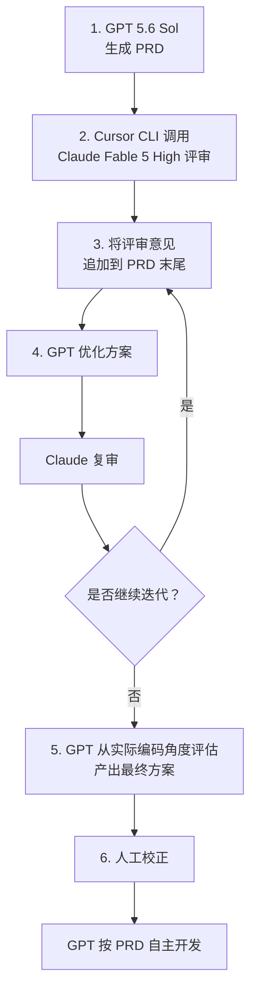

## 摘要

先用一个模型生成 PRD，再让不同模型交叉评审、修正并从编码角度检查，可以在开发前暴露需求歧义和方案遗漏。这个过程的目标不是追求完美文档，而是形成一份足够明确、可实现、可验收的开发规格。

## 方法原文

一种 Spec Coding / PRD 交叉评审方法：

  1. 用 GPT 5.6 Sol 生成 PRD。
  2. 调用 Cursor CLI，让 Claude Fable 5 High 评审。
  3. 把评审意见追加到 PRD 末尾。
  4. 再让 GPT 优化方案，并交给 Claude 复审，如此迭代几轮。
  5. 最后让 GPT 从实际编码角度评估，产出最终方案。
  6. 人工校正一次后，让 GPT 按 PRD 自主开发。

  核心观点是：利用不同顶级模型互相生成、挑错和修正，把需求和技术方案提前打磨充分，从而减少开发中的反复沟通，提高一次产出可用成品的概率。

## 流程图

### 示例图片

### 用不同模型形成生成与评审闭环

一种 Spec Coding 工作流是：先由一个模型生成 PRD，再调用另一个模型进行评审，把评审意见追加到 PRD 中。原模型根据意见重新思考和优化方案，然后再次交叉评审，如此迭代数轮。

在产品需求基本稳定后，再让模型从实际编码的角度检查一次，确认需求是否足够具体、技术方案能否落地，以及实现过程中是否仍存在需要临时猜测的地方。人完成最后一轮校正后，再将 PRD 交给编码智能体开发。

### PRD 要成为可执行的规格

这里的 PRD 不只是传统的产品需求说明，而是连接产品判断与代码实现的开发规格。除了目标、用户场景和功能流程，还需要写清业务规则、界面或接口行为、数据要求、边界情况、技术约束与验收标准。

交叉评审真正要消除的是实现中的不确定性：如果编码智能体仍需自行猜测关键行为，说明规格还不够完整；如果每项需求都能对应到明确的实现结果和验收条件，PRD 才具备直接驱动开发的能力。

### 多模型评审不能替代验证

不同模型能够从不同角度发现遗漏，但反复评审本身不能证明方案正确。模型可能共享相似盲点，也可能把文档打磨得完整却仍然理解错了真实需求。因此，人仍需确认问题与取舍，最终实现仍要通过测试、验收标准和实际使用结果验证。

这套方法更适合把多模型协作看作规格阶段的质量门槛：它提高一次实现成功的概率，但不等于保证一次生成完美成品。

经验来源：[AI产品黄叔的推文](https://x.com/PMbackttfuture/status/2093532336738517127)

## 相关笔记

- [[AI 编程基本功的核心是组织并验证复杂性]]
