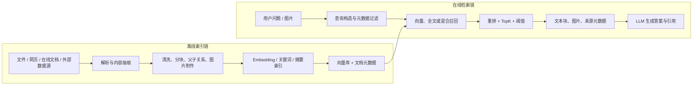
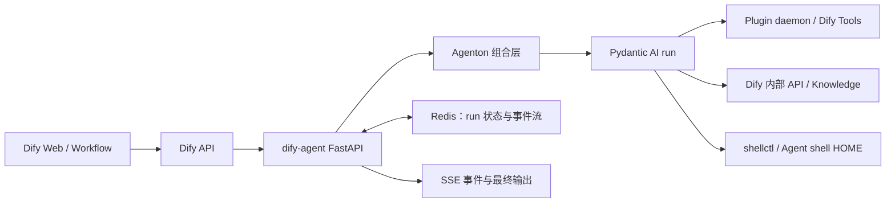

# Dify 核心功能与能力调研

## 摘要

这是一份截至 2026-07-21、仅依据 Dify 官方文档、官方网站、官方仓库和发布记录整理的能力快照，覆盖应用形态、工作流、模型、RAG、Agent、插件、交付、可观测性、治理、安全、部署边界，以及 RAG 与 Agent 的技术实现细节。

> 调研日期：2026-07-21  
> 证据范围：仅采用 Dify 官方文档、Dify 官方网站、`langgenius/dify` 官方仓库及官方发布记录。本文描述的是调研当日可由官方一手资料确认的能力；Cloud 套餐额度、Enterprise 授权项和 Beta 功能可能继续变化。

版本快照：截至调研日，Community 官方最新正式版为 **v1.16.0（2026-07-17）**；该版本中的 New Agent 仍标为 Open Beta。[v1.16.0 Release](https://github.com/langgenius/dify/releases/tag/1.16.0)

## 一、结论先行

Dify 目前最适合被理解为一个**模型中立的 AI 应用开发与运行平台**，而不只是聊天机器人搭建器。它把可视化工作流、基础 LLM 应用、Agent、RAG/知识流水线、模型与工具插件、发布接口、运行日志和外部追踪整合在同一工作空间中，目标是让团队从原型走到可运行应用。官方仓库将其概括为“生产就绪的 agentic workflow 开发平台”，核心组件包括 workflow、RAG pipeline、Agent、模型管理、可观测性和 Backend-as-a-Service。[官方仓库](https://github.com/langgenius/dify)

它的核心价值可以归纳为四点：

1. **编排**：用 Workflow/Chatflow 把模型、知识、工具、代码、HTTP、分支、循环和人工审批组合成受控流程。
2. **数据增强**：内建完整 RAG 链路，也能连接外部知识系统或构建自定义知识流水线。
3. **模型与扩展解耦**：模型、工具、Agent 策略、数据源和触发器均可通过插件扩展，不绑定单一模型厂商。
4. **交付与运营**：应用可直接发布成 Web App、REST API、网页嵌入或 MCP Server，并配有日志、反馈、标注、指标与第三方 tracing。

选型时最重要的版本边界是：**Community 提供公开仓库中的核心能力，但只允许单工作空间，并受 Dify Open Source License 的多租户和前端品牌条款约束；Enterprise 才明确包含多工作空间、SSO、高可用、企业管理、进阶安全控制、审计/合规与商业授权。**[官方版本对比](https://dify.ai/pricing/dify-enterprise) [开源许可证](https://github.com/langgenius/dify/blob/main/LICENSE)

另外，新版 New Agent 仍处于 Beta。官方明确提示：Community Edition 面向多个终端用户时是**软隔离**，不是严格的逐用户/逐运行文件系统隔离；有严格安全或合规要求时，应采用 Dify Cloud、Enterprise 或另行构建强化隔离基础设施。[New Agent 官方说明](https://docs.dify.ai/en/self-host/use-dify/build/new-agent/overview)

## 二、产品定位与整体架构

Dify 的产品边界覆盖 AI 应用的主要生命周期：

- **构建**：Prompt、变量、模型配置、可视化节点编排、Agent 和知识接入。
- **扩展**：模型插件、工具插件、Agent Strategy、Extension Endpoint、Datasource、Trigger。
- **发布**：Web App、服务 API、网页嵌入、MCP Server、Marketplace。
- **运营**：运行日志、用户反馈、标注回复、用量与性能仪表盘、外部可观测平台。
- **组织**：Workspace 隔离应用、知识库、成员、模型凭据、集成与计费资源。[Workspace 官方说明](https://docs.dify.ai/en/cloud/use-dify/workspace/readme)

因此，Dify 更像“面向生成式 AI 的低代码应用平台 + LLMOps/RAG 运行层”，而不是底层模型训练框架。官方资料没有把预训练或微调模型列为平台核心能力；模型推理通常来自外部模型 API、本地模型服务或模型插件。

## 三、应用形态

截至调研日，官方文档可确认以下应用形态：

| 应用形态 | 交互特征 | 适合场景 | 关键边界 |
|---|---|---|---|
| Chatbot | 多轮聊天，以一个模型、Prompt 和可选知识库为核心 | 内部问答、知识助手 | 不适合自主工具调用或多步骤流程；单会话最多保留 500 条消息或 2,000 tokens 的历史，先到上限者触发淘汰旧消息。[官方文档](https://docs.dify.ai/en/self-host/use-dify/build/chatbot) |
| Text Generator | 单轮输入、单次模型生成 | 摘要、翻译、文案、SQL 生成 | 不含多轮对话、工具调用或多步骤工作流。[官方文档](https://docs.dify.ai/en/self-host/use-dify/build/text-generator) |
| Agent（经典） | 多轮聊天，模型自主决定推理步骤和工具调用 | 搜索、数据查询、生成图表等开放式任务 | 结果受模型推理和工具调用可靠性影响；历史同样有 500 条消息或 2,000 tokens 上限。[官方文档](https://docs.dify.ai/en/self-host/use-dify/build/agent) |
| New Agent（Beta） | 独立沙箱中的 AI worker，可运行命令、安装程序、读写文件 | 更开放的研究、编码、文件处理任务 | Beta；CE 为软隔离。可独立作为聊天应用，也可作为 Workflow 节点。[官方文档](https://docs.dify.ai/en/self-host/use-dify/build/new-agent/overview) |
| Workflow | 单次、从头到尾执行的可视化流程 | 自动报告、数据处理、批处理、事件驱动自动化 | 无天然对话层；可由用户/API 或 Trigger 启动。[官方文档](https://docs.dify.ai/en/self-host/use-dify/build/workflow-chatflow) |
| Chatflow | 每条用户消息触发一次流程，并保留会话上下文 | 有确定流程的客服、引导问答、交互式助手 | 始终由用户消息启动，不支持 Trigger；必须用 Answer 节点结束。[官方文档](https://docs.dify.ai/en/self-host/use-dify/build/workflow-chatflow) |

官方 API 索引仍同时列出 Chatbot、Agent、New Agent、Chatflow、Workflow 和 Text Generator，说明这些形态在接口层并存，而不是 New Agent 已完全替代经典 Agent。[官方 API 文档索引](https://docs.dify.ai/llms.txt)

## 四、Workflow 与 Chatflow 的核心编排能力

Workflow 与 Chatflow 共用可视化画布和节点系统。官方节点目录可确认的主要能力包括：

- **AI 与知识**：LLM、Agent、Knowledge Retrieval、Question Classifier、Parameter Extractor、Document Extractor。
- **控制流**：IF/ELSE、Iteration、Loop、Variable Aggregator、List Operator、Output/Answer。
- **数据处理**：Template（Jinja2）、Variable Assigner、Python/JavaScript Code。
- **外部连接**：HTTP Request、Tool。
- **人在回路**：Human Input 可暂停执行，通过 Web App 或邮件收集表单与审批决定，并按按钮分支继续；支持超时路径。[Human Input](https://docs.dify.ai/en/self-host/use-dify/nodes/human-input)
- **启动方式**：Workflow 可由用户/API 按需运行，也可用定时、集成事件或 Webhook Trigger 自动运行；Chatflow 只能由用户输入启动。[Start/Trigger](https://docs.dify.ai/en/self-host/use-dify/nodes/start)

Code 节点支持 Python 和 JavaScript，在独立 sandbox 容器中执行；官方说明其用于转换、计算和自定义逻辑，并提供重试、失败分支及输出限制。它不是无限制运行环境，默认会限制文件系统、系统命令和网络访问，网络请求由 SSRF proxy 控制。[Code 节点](https://docs.dify.ai/en/self-host/use-dify/nodes/code)

工程化方面，Chatflow/Workflow 的功能文档描述了草稿、线上最新版本、历史发布版本、版本命名/说明和恢复旧版本；恢复会覆盖当前草稿，且文档称该能力只适用于 Chatflow 和 Workflow。[版本控制](https://docs.dify.ai/en/self-host/use-dify/build/version-control) 但当前 Cloud/Enterprise 价格对比页仍在部分套餐的 “App Version Control” 项上标注 “Coming Soon”，因此正式选型时应按目标版本和套餐向 Dify 确认实际可用范围。[价格对比](https://dify.ai/pricing)

## 五、模型与供应商能力

Dify 的模型层是模型中立和插件化的：

- 官方仓库称其可集成来自数十家推理供应商和自托管方案的数百种专有/开源模型，并支持 OpenAI API-compatible 模型。[官方仓库](https://github.com/langgenius/dify)
- 工作空间管理员可安装模型提供商并配置自有 API Key；凭据在工作空间内共享。Cloud 还提供 AI Credits，同时允许 BYOK，并可设置 Credits 与自有 Key 的使用优先级。[模型提供商文档](https://docs.dify.ai/en/cloud/use-dify/workspace/model-providers)
- 模型插件接口覆盖 LLM、Text Embedding、Rerank、Speech-to-Text、Text-to-Speech 和 Moderation；这也是 Dify 可插拔模型能力的明确边界。[模型插件接口](https://docs.dify.ai/en/develop-plugin/features-and-specs/plugin-types/model-schema)
- 多模态能力取决于所选模型。官方应用文档会按模型能力开放 Vision、Audio、Document 等输入设置，知识库也可使用多模态 embedding 和 vision rerank。[Chatbot 多模态说明](https://docs.dify.ai/en/self-host/use-dify/build/chatbot) [知识库索引说明](https://docs.dify.ai/en/self-host/use-dify/knowledge/create-knowledge/setting-indexing-methods)
- Chatbot、Text Generator 与经典 Agent 支持最多同时用 4 个模型调试对比，适合做 Prompt/模型的人工横向比较。[Chatbot 调试说明](https://docs.dify.ai/en/self-host/use-dify/build/chatbot)

需要注意：Dify 统一的是模型接入和应用编排，不会消除上游供应商的价格、限流、地域、数据处理政策、上下文窗口和工具调用差异。自托管 Dify 也不等于模型请求必然留在本地；是否出网取决于实际配置的模型和工具。

## 六、知识库与 RAG

Dify 的 RAG 能力覆盖数据接入、处理、索引、检索、应用集成和调优：

### 6.1 数据接入与知识形态

- 可创建开箱即用知识库，导入文件、文本、网站或在线内容；官方 API 文档明确列出 PDF、TXT、DOCX 等常见文件格式。[Knowledge API](https://docs.dify.ai/en/api-reference/guides/knowledge)
- 可设计**知识流水线**，按“数据源 → 数据提取 → 数据处理 → 知识存储”组织节点；支持模板、从空白创建和导入已有 pipeline。[知识流水线](https://docs.dify.ai/en/self-host/use-dify/knowledge/knowledge-pipeline/readme)
- Datasource 插件可把网页抓取、在线文档和在线网盘等外部内容送入知识流水线。[Datasource 插件](https://docs.dify.ai/en/develop-plugin/dev-guides-and-walkthroughs/datasource-plugin)
- 可通过 External Knowledge API 对接团队已有 RAG/第三方知识服务，无需把内容迁入 Dify。边界是 Dify 只有检索访问权，不能修改或管理外部内容。[外部知识库](https://docs.dify.ai/en/self-host/use-dify/knowledge/connect-external-knowledge-base)

### 6.2 分块与索引

- 支持 General 和 Parent-child 两种文本分块模式；Parent-child 用小子块匹配、返回较大父块，平衡召回精度与上下文完整性。
- 支持 delimiter、最大块长度、块重叠、预清洗、块摘要自动生成与预览。分块模式在知识库创建后不可更改；Full Doc 父块模式只处理前 10,000 tokens。[分块设置](https://docs.dify.ai/en/self-host/use-dify/knowledge/create-knowledge/chunking-and-cleaning-text)
- 索引分为 High Quality 与 Economical。High Quality 使用 embedding，支持向量、全文和混合检索；Economical 使用倒排索引。High Quality 创建后不能降级为 Economical。[索引与检索](https://docs.dify.ai/en/self-host/use-dify/knowledge/create-knowledge/setting-indexing-methods)

### 6.3 检索与调优

- High Quality 支持 Vector Search、Full-Text Search、Hybrid Search；Hybrid 可设置语义/关键词权重或启用 rerank。
- 支持 Rerank、Top K、Score Threshold；多模态知识库需要匹配的多模态 rerank，否则图片会被排除在重排结果之外。[索引与检索](https://docs.dify.ai/en/self-host/use-dify/knowledge/create-knowledge/setting-indexing-methods)
- 支持检索测试、手工维护文档与 chunk、内置/自定义元数据和批量标注。元数据值类型包括 string、number、time，并可用于过滤以缩小检索范围。[元数据](https://docs.dify.ai/en/self-host/use-dify/knowledge/metadata)
- 知识库、文档、chunk、标签、元数据、检索测试和知识流水线均有 API。[知识 API 概览](https://docs.dify.ai/en/api-reference/guides/knowledge)

RAG 的边界也应明确：它能减少没有依据的生成，但不能保证答案正确；效果仍取决于源文档质量、分块、embedding、检索策略、rerank、模型上下文和 Prompt。外部知识连接只规定检索接口，不替代外部系统的内容治理。

## 七、Agent、工具与 MCP

经典 Agent 会让模型决定是否以及何时调用工具。Dify 会对原生支持工具调用的模型显示 Function Calling 模式，对其他模型使用 ReAct 提示策略；可设置 Maximum Iterations 控制“思考—调用—处理结果”的最大循环次数，代价是复杂任务会增加延迟和 token 成本。[经典 Agent](https://docs.dify.ai/en/self-host/use-dify/build/agent)

工具可由 Agent、Workflow 和 Chatflow 调用，用于搜索、数据库、图像生成、外部 API 等动作。工具插件可以定义多个工具函数、凭据和结构化入输出；工具返回支持文本、链接、图片、文件、JSON 和工作流变量。[工具插件](https://docs.dify.ai/en/develop-plugin/dev-guides-and-walkthroughs/tool-plugin) [工具返回](https://docs.dify.ai/en/develop-plugin/features-and-specs/plugin-types/tool)

MCP 有两个方向：

- **Dify 应用作为 MCP Server**：发布后的应用可生成 MCP URL，被 Claude Desktop、Cursor 等客户端当成工具使用。该 URL 内含认证凭据，应像 API Key 一样保管和轮换。[发布为 MCP Server](https://docs.dify.ai/en/cloud/use-dify/publish/publish-mcp)
- **Dify 内部消费 MCP 工具**：官方 MCP 发布文档也明确指向在 workflow/agent 内使用 MCP 工具的能力。[同上](https://docs.dify.ai/en/cloud/use-dify/publish/publish-mcp)

Agent 的核心边界是非确定性：模型可能选错工具、生成错误参数、提前停止或反复调用。Maximum Iterations 只限制循环，不等于保证任务正确完成；关键业务动作应结合工作流约束、人工审批、权限隔离和日志审计。

## 八、插件与扩展体系

官方插件体系目前明确支持六类扩展点：

| 插件类型 | 作用 |
|---|---|
| Model | 增加 LLM、embedding、rerank、TTS、STT、moderation 模型 |
| Tool | 向 Agent/Workflow 增加可调用动作 |
| Agent Strategy | 替换或扩展 Agent 的推理/工具决策循环 |
| Extension (Endpoint) | 暴露 HTTP 入口，让外部系统调用插件逻辑或驱动 Dify |
| Datasource | 把外部文档送入知识流水线 |
| Trigger | 让上游 webhook/事件自动启动 Workflow |

来源：[插件类型选择](https://docs.dify.ai/en/develop-plugin/getting-started/choose-plugin-type)

插件可从 Marketplace、GitHub 仓库或本地 `.difypkg` 分发；也支持开发期远程调试。插件可以反向调用同一 Workspace 内的 App、模型、工具和部分工作流节点，但不能任意跨 Workspace 访问应用。[插件总览](https://docs.dify.ai/en/develop-plugin/getting-started/getting-started-dify-plugin) [反向调用](https://docs.dify.ai/en/develop-plugin/features-and-specs/advanced-development/reverse-invocation)

边界与风险：插件通常运行第三方代码并可连接外部服务，安装前应审查作者、权限、凭据、数据传输和隐私政策。Dify Marketplace 要求插件披露是否收集或传输个人数据，但这一要求不等于第三方插件天然可信。[官方隐私规范](https://docs.dify.ai/en/develop-plugin/publishing/standards/privacy-protection-guidelines)

## 九、API、嵌入与交付能力

每个发布的 Dify 应用都会同时成为 REST API，知识库也有独立 API。应用 Key 作用域是单个应用；Knowledge API Key 的范围更广，可访问创建者可见的全部知识库。官方明确要求 Key 只放在后端，不应嵌入前端或客户端。[API 入门](https://docs.dify.ai/en/api-reference/guides/get-started)

接口覆盖：

- Chat/Agent/New Agent 消息、会话、文件、语音；
- Text Generator completion；
- Workflow 运行、停止、流式事件、运行历史；
- Human Input 暂停与恢复；
- 反馈、标注、应用参数和终端用户；
- 知识库、文档、chunk、元数据、标签、模型和知识流水线。

支持 blocking 和 SSE streaming 两种响应方式，具体可用项按应用类型区分。[API 文档索引](https://docs.dify.ai/llms.txt)

发布渠道包括：

- 自动生成的响应式 Web App；
- REST API；
- iframe、聊天气泡等网页嵌入；
- MCP Server；
- Marketplace 分享。

发布后，Web App、API、嵌入和 MCP 使用当前已发布配置；更新草稿不会自动影响线上，需再次发布。[发布总览](https://docs.dify.ai/en/cloud/use-dify/publish/README)

## 十、可观测性、日志与评测能力

### 10.1 内建观测

- Dashboard 跟踪 Total Messages、Active Users、Average User Interactions 和 Token Usage，用于观察参与度、资源与成本趋势。[仪表盘](https://docs.dify.ai/en/cloud/use-dify/monitor/analysis)
- 生产 Web App/API 交互日志记录完整输入输出、时间、模型、token、响应耗时、错误/警告和用户反馈；调试会话与 Prompt 测试不进入应用日志。[日志](https://docs.dify.ai/en/cloud/use-dify/monitor/logs)
- Chat/Agent 类应用可收集点赞/点踩与评论，并把优秀答案整理为 Annotation。Annotation Reply 会做语义匹配，命中阈值时直接返回人工维护的答案，否则继续正常模型生成。[标注系统](https://docs.dify.ai/en/use-dify/monitor/annotation-reply)

### 10.2 外部 tracing

官方文档列出 LangSmith、Langfuse、Opik、W&B Weave、Arize、Phoenix 和 Alibaba Cloud Monitor 集成。以 LangSmith 为例，可同步 Workflow/Chatflow、消息、moderation、知识检索和工具调用的 trace，包括输入、输出、节点执行、模型与 token、延迟、状态和错误。[LangSmith 集成](https://docs.dify.ai/en/cloud/use-dify/monitor/integrations/integrate-langsmith)

### 10.3 “评测”能力边界

官方资料可确认的是：多模型调试对比、知识检索测试、运行历史、终端用户反馈、Annotation 命中/质量分析，以及通过外部可观测平台分析 traces。这些组成了人工和生产反馈驱动的改进闭环。

但在本次查到的官方核心文档中，**未找到一个可与专业 LLM evaluation 平台等同的、通用的离线评测套件说明**，例如固定测试集批量跑分、LLM-as-a-judge、自定义评分器、实验统计显著性和跨版本回归门禁。因此，如果团队需要严格的自动化评测/发布门禁，现阶段应把 Dify 的日志与 API 接入外部评测体系，而不应把“日志 + 标注”误认为完整评测平台。

## 十一、团队协作与治理

Workspace 是资源与权限的基本隔离单位，包含 Apps、Knowledge Bases、Members、Model Providers、Integrations 和 Billing。[Workspace](https://docs.dify.ai/en/cloud/use-dify/workspace/readme)

标准 Workspace 有四种内置角色：

- Owner：完整控制，每个 Workspace 一个；
- Admin：管理成员和模型提供商，并拥有 Editor 能力；
- Editor：创建、编辑、删除应用和知识库；
- Normal：仅使用已发布应用。

成员邀请链接 72 小时过期；移除成员后，其创建的应用和知识库仍留在 Workspace。[成员管理](https://docs.dify.ai/en/cloud/use-dify/workspace/team-members-management)

Workflow/Chatflow 可通过 DSL 导入导出、片段复用和版本历史协作。Enterprise 官方发布记录还确认了实时多人 Workflow 编辑，以及细粒度 RBAC、资源级访问、Admin API 权限管理等企业能力。[Enterprise v3.11.1 发布记录](https://ee.dify.ai/releases/)

## 十二、部署形态与版本差异

### 12.1 Dify Cloud

官方托管 SaaS，免部署。当前公开套餐为 Sandbox、Professional、Team，不同套餐限制成员、应用数、知识文档/存储、知识请求速率、触发事件、标注数量、日志保留和 API 速率；具体额度应以实时价格页为准。[Cloud 定价](https://dify.ai/pricing)

### 12.2 Community Edition

- 免费自托管，可运行在支持 Docker 的本机、内网服务器或云 VM；官方首选 Docker Compose，也可从源码运行。[部署总览](https://docs.dify.ai/en/self-host/deploy/overview)
- 最低硬件要求为 2 CPU cores、4 GiB RAM；标准 Compose 会启动 API、Web、worker、plugin daemon、agent backend，以及 PostgreSQL、Redis、Weaviate、Nginx、SSRF proxy、sandbox 等依赖服务。[Docker Compose](https://docs.dify.ai/en/self-host/deploy/quick-start/docker-compose)
- 官方价格页定义为：公开仓库中的全部核心功能、单 Workspace、遵守 Dify Open Source License。[版本对比](https://dify.ai/pricing/dify-enterprise)
- 开源许可证基于 Apache 2.0 但有附加条件：未经 Dify 书面授权不得用源代码运营多租户环境；一个 tenant 被定义为一个 Workspace；使用 Dify 前端时不得删除或修改 Console/Application 中的 LOGO 和版权信息。[LICENSE](https://github.com/langgenius/dify/blob/main/LICENSE)

### 12.3 Dify Premium on AWS

这是部署到用户 AWS VPC 的 EC2 AMI，不是 Dify 托管 Cloud。官方说明其支持一键部署和 Web App 品牌/logo 定制，适合有数据驻留诉求的中小团队或 Enterprise 前的 POC。[Premium 官方文档](https://docs.dify.ai/en/self-host/deploy/platform-guides/dify-premium)

### 12.4 Enterprise

官方明确列出的 Enterprise 专属项包括：

- 商业授权；
- 多 Workspace 与企业管理；
- SSO（SAML、OIDC、OAuth2）；
- 高可用/可扩展部署；
- 高级安全与控制、审计日志和合规能力；
- 企业级更新维护、技术支持和可协商 SLA；
- LLM API load balancing、Workspace/角色治理、品牌定制等对比项。

来源：[Enterprise 版本对比](https://dify.ai/pricing/dify-enterprise) [部署文档](https://docs.dify.ai/en/self-host/deploy/overview)

官方 2026 年 Enterprise 发布记录还可确认更细粒度的 RBAC、资源 ACL、Admin API RBAC、SCIM/SSO 相关修复、审计组件以及可选实时多人 Workflow 编辑；但这些能力可能依赖具体 Enterprise 版本、Helm 配置和许可证，采购前应按目标版本向 Dify 确认。[Enterprise 发布记录](https://ee.dify.ai/releases/)

## 十三、安全能力与关键限制

### 已确认的安全设计

- 自托管将 Dify 数据保留在用户控制的基础设施中；但连接外部模型、插件和工具时仍会产生出站数据流。[Enterprise 版本页](https://dify.ai/pricing/dify-enterprise)
- Code 节点通过独立 sandbox 运行，并用输出限制和 SSRF proxy 约束执行；外部知识连接的出站 HTTP 同样经过 SSRF proxy。[Code 节点](https://docs.dify.ai/en/self-host/use-dify/nodes/code) [外部知识库](https://docs.dify.ai/en/self-host/use-dify/knowledge/connect-external-knowledge-base)
- MCP URL 内含认证信息；App API Key 只应由后端保存；Knowledge API Key 权限范围比单 App Key 更广。[MCP](https://docs.dify.ai/en/cloud/use-dify/publish/publish-mcp) [API](https://docs.dify.ai/en/api-reference/guides/get-started)
- 官方仓库提供私密漏洞报告渠道，并建议部署者保持版本更新。[安全政策](https://github.com/langgenius/dify/blob/main/SECURITY.md)

### 不能忽略的限制

1. **New Agent CE 隔离不是强安全边界**：恶意 Prompt、工具执行等仍可能访问预期工作目录之外的数据；严格合规场景不能只依赖默认 CE 沙箱。[官方警告](https://docs.dify.ai/en/self-host/use-dify/build/new-agent/overview)
2. **日志可能包含完整对话和敏感数据**：官方要求部署者实施访问控制、隐私政策与适用的数据保护合规；Cloud Sandbox 日志保留 30 天，Professional/Team 在订阅期内无限保留。[日志文档](https://docs.dify.ai/en/cloud/use-dify/monitor/logs)
3. **插件与外部服务扩大供应链和数据出境面**：Marketplace 隐私披露不能代替代码审计、网络策略和凭据最小权限。
4. **LLM/RAG/Agent 没有结果保证**：仍可能幻觉、错检、漏检或误调用工具。高风险流程应使用确定性分支、Human Input、权限和外部评测。
5. **Community 不是任意 SaaS 多租户许可证**：技术上能部署不代表许可证允许；多 Workspace/多租户和前端去品牌需先核对商业授权。[LICENSE](https://github.com/langgenius/dify/blob/main/LICENSE)
6. **自托管责任归用户**：容量规划、数据库/对象存储、备份恢复、TLS、密钥管理、升级、监控、CVE 修补与网络隔离均需自行运维。官方升级文档要求按目标版本 Release Notes 操作，并关注新增环境变量。[Docker Compose](https://docs.dify.ai/en/self-host/deploy/quick-start/docker-compose)

## 十四、适用场景与不适用场景

### 适合

- 需要快速搭建并持续迭代 LLM/RAG 应用的产品或业务团队；
- 希望用可视化工作流约束模型行为，同时允许少量代码和 API 扩展的团队；
- 需要模型可替换、知识库可管理、应用可 API 化的内部 AI 平台；
- 需要 Agent 工具调用，但又希望用流程、日志和人工节点增加可控性的场景；
- 希望在 Cloud 与私有部署之间保留选择权的组织。

### 不宜直接承担

- 底层模型训练、微调或 GPU 推理调度平台；
- 默认配置即可满足强隔离、零信任或受监管审计的多租户执行平台；
- 要求严格确定性、形式化验证或“永不出错”的业务核心决策系统；
- 不做额外工程就期望获得完整离线评测、回归门禁和成本治理体系的场景。

## 十五、最终判断

Dify 的核心竞争力是把“模型 + RAG + 工具 + 工作流 + 发布 + 观测”做成一个统一、可视化且可扩展的平台。Community 足以验证大多数单 Workspace 的核心产品能力；Cloud 适合减少运维投入；Enterprise 的价值主要集中在多 Workspace、SSO/RBAC、审计合规、高可用、商业授权和官方支持，而不是另一套完全不同的应用编排引擎。

如果用于生产选型，建议先验证四件事：

1. 目标模型、工具和数据源是否满足地域、合规、成本及 SLA；
2. RAG 在真实业务集上的召回与回答质量；
3. Agent/插件/代码节点的执行权限、网络和数据隔离；
4. Community、Cloud、Premium、Enterprise 的 Workspace、日志、品牌、HA、SSO 与许可证边界是否满足组织要求。

## 官方来源清单

- [Dify 官方 GitHub 仓库](https://github.com/langgenius/dify)
- [Dify 官方文档索引](https://docs.dify.ai/llms.txt)
- [Workflow & Chatflow](https://docs.dify.ai/en/self-host/use-dify/build/workflow-chatflow)
- [应用发布总览](https://docs.dify.ai/en/cloud/use-dify/publish/README)
- [API 入门](https://docs.dify.ai/en/api-reference/guides/get-started)
- [Knowledge 总览](https://docs.dify.ai/en/self-host/use-dify/knowledge/readme)
- [插件总览](https://docs.dify.ai/en/develop-plugin/getting-started/getting-started-dify-plugin)
- [监控日志](https://docs.dify.ai/en/cloud/use-dify/monitor/logs)
- [Workspace 与成员管理](https://docs.dify.ai/en/cloud/use-dify/workspace/readme)
- [自托管部署](https://docs.dify.ai/en/self-host/deploy/overview)
- [Community / Enterprise 版本对比](https://dify.ai/pricing/dify-enterprise)
- [Cloud 定价与额度](https://dify.ai/pricing)
- [Dify Open Source License](https://github.com/langgenius/dify/blob/main/LICENSE)
- [官方 Release 页面](https://github.com/langgenius/dify/releases)
- [Enterprise Release 页面](https://ee.dify.ai/releases/)

## 尚待官方进一步确认的事项

- Enterprise 的最终报价、具体 SLA、支持范围、部署拓扑与各项高级安全控制需要商务确认，公开页面没有给出完整实施细则。
- Enterprise 3.x 与 Community 1.x 的版本号和发布节奏不同；不能只按数字大小判断功能是否一一对应。
- New Agent 标注为 Beta，其隔离模型、兼容性和生产建议仍可能快速变化。
- 官方版本控制文档显示 Chatflow/Workflow 已具备版本历史与恢复能力，但价格矩阵仍有相关“Coming Soon”或付费能力表述，公开口径没有完全同步；正式使用前需按目标部署形态和套餐确认。[版本控制](https://docs.dify.ai/en/cloud/use-dify/build/version-control) [版本矩阵](https://dify.ai/pricing/dify-enterprise)
- 官方公开页面中的套餐额度、日志保留、触发事件与 API 限额会变化，正式采购前应重新核对实时价格页与合同。
- 本次未在官方核心文档中确认通用离线自动评测套件；若 Dify 后续新增相关模块，应以届时版本文档为准。

---

## 技术附录 A：RAG 深度拆解

### A.1 总体架构：离线索引与在线检索是两条链



Dify 的 `api/core/rag` 源码目录将能力拆为 extractor、cleaner、splitter、embedding、docstore、retrieval、rerank、data post-processor、pipeline、summary index 等模块。这说明它并不是一个单独的“向量检索函数”，而是一组可组合的知识处理和查询组件。[RAG 源码目录](https://github.com/langgenius/dify/tree/main/api/core/rag)

### A.2 离线索引链

#### 1. 数据摄取

Knowledge Pipeline 的标准结构是：Data Source → Data Processing → Knowledge Base。官方内置或可扩展的数据源包括本地文件、在线网盘、在线文档、网页爬虫，Marketplace 还能增加新的数据源。网页侧可使用 Jina Reader、Firecrawl 等连接器；实际可用项取决于部署版本和已安装插件。[Knowledge Pipeline](https://docs.dify.ai/en/self-host/use-dify/knowledge/knowledge-pipeline/knowledge-pipeline-orchestration)

文件上传后不会立刻变成可查询知识。索引任务会依次经历 waiting、parsing、cleaning、splitting、indexing、completed 或 error 等状态；API 创建文档时返回 `batch`，客户端可以轮询批次状态。因此，大文件导入、批量重建索引和生产发布都应按异步任务设计。[索引状态 API](https://docs.dify.ai/en/api-reference/documents/get-document-indexing-status)

#### 2. 内容抽取与多模态处理

抽取器负责把 PDF、Office、HTML 等源格式转换成后续节点可处理的文本和结构。Pipeline 可以选择 Dify Extractor、Unstructured 等处理方式。图片可作为 chunk 的附件保留；使用多模态 embedding 时，图片也能参与索引和检索。检索后若下游是视觉模型，图片可随命中的 chunk 一起进入模型上下文。[Knowledge Pipeline](https://docs.dify.ai/en/self-host/use-dify/knowledge/knowledge-pipeline/knowledge-pipeline-orchestration)

这里的主要风险不在向量库，而在解析质量：扫描 PDF 的 OCR、跨页表格、页眉页脚、双栏布局、图片与正文对应关系一旦抽错，后续 embedding 和 rerank 很难补救。

#### 3. 分块策略

| 模式 | 索引和返回方式 | 适用场景 | 主要代价 |
|---|---|---|---|
| General | 同一个 chunk 用于召回和返回 | FAQ、短文档、结构均匀文本 | chunk 小则语义不完整，大则噪声和 token 增加 |
| Parent-child | 小的 child 用于匹配，较大的 parent 返回给模型 | 手册、制度、技术文档，需要精确命中又要完整上下文 | 索引与关系管理更复杂，返回文本更长 |
| Full Doc parent | child 匹配，整篇文档作为 parent | 短报告、单页说明 | 官方当前限制只处理前 10k tokens，长文不适合 |

General 模式可配置分隔符、最大 chunk 长度和 overlap。Parent-child 的核心是把“检索粒度”和“生成上下文粒度”分离：child 提升命中精度，parent 减少断章取义。清洗可以归一化空白、去除 URL/邮箱等；Full Doc 模式会忽略部分清洗设置。[分块与清洗](https://docs.dify.ai/en/self-host/use-dify/knowledge/create-knowledge/chunking-and-cleaning-text)

`overlap` 不是越大越好。它能保留跨边界语义，但会增加重复向量、召回重复和上下文浪费。更合理的做法是根据标题层级、段落和业务语义先确定边界，再以少量 overlap 处理边界信息。

#### 4. 摘要索引

Summary Index 会为原始 chunk 生成摘要，并对摘要建立额外的向量检索层；摘要命中后返回对应的原始 chunk。它适合原文冗长、用户提问高度概括、原文与问题措辞差异较大的场景。摘要可异步生成、手工修改或重新生成，也支持多模态内容；当前官方说明其用于 High Quality 索引。[Summary Index 发布说明](https://github.com/langgenius/dify/discussions/31890)

摘要索引的风险是信息压缩失真：摘要模型如果漏掉编号、例外条件或数值，召回阶段可能直接错过原文。因此它应作为增加召回面的附加索引，而不是事实存储的替代品。

### A.3 索引方法与存储

#### High Quality

High Quality 会调用 embedding 模型生成稠密向量，支持：

- Vector Search：按向量相似度召回，可继续 rerank；
- Full-text Search：按关键词/全文匹配召回，可继续 rerank；
- Hybrid Search：并行使用向量和全文结果，再使用加权分数或 rerank 合并。

这条路径效果上限较高，但会产生 embedding 成本、索引构建时间和向量存储成本。一旦知识库选择 High Quality，官方当前不支持降级为 Economical。[索引与检索设置](https://docs.dify.ai/en/self-host/use-dify/knowledge/create-knowledge/setting-indexing-methods)

#### Economical

Economical 为每个 chunk 提取关键词并建立倒排索引，不产生 embedding token 成本，检索只提供 TopK。它适合预算敏感、术语匹配明显、规模较小的知识库；对同义改写、概念问法和跨语言查询通常弱于语义检索。[索引与检索设置](https://docs.dify.ai/en/self-host/use-dify/knowledge/create-knowledge/setting-indexing-methods)

#### 向量数据库

Dify 把向量存储做成可配置基础设施，Community 的 Docker 默认配置与可选后端可能随版本变化。因此工程上不应把 Dify RAG 等同于某一种向量数据库。真正需要约束的是：embedding 模型及维度、collection/index 的生命周期、备份恢复、索引重建时的双写或切换、数据量和查询并发。

### A.4 在线查询链

#### 1. Knowledge Retrieval 节点输入

节点接收文本查询，也可以接收图片查询；图片只有在知识库采用多模态 embedding 时才有意义。一个节点可以连接多个知识库，Dify 会并行查询并合并候选结果。[Knowledge Retrieval 节点](https://docs.dify.ai/en/self-host/use-dify/nodes/knowledge-retrieval)

查询质量高度依赖输入。对话中的最后一句经常包含“它”“上一个方案”之类指代，因此生产应用常在检索前增加一个 LLM/Code 节点，将历史对话重写成可独立检索的问题；这属于应用层设计，不是 Dify 自动保证的能力。

#### 2. 两级筛选

检索配置实际存在两层：

1. 知识库级配置先决定初始召回方式和候选池；
2. Knowledge Retrieval 节点或应用级配置再对多库结果做 weighted score 或 rerank，并应用 TopK、score threshold 和 metadata filter。

Weighted Score 本质是融合语义分数和关键词分数；rerank 则把 query 与候选 chunk 交给专用排序模型重新评分。多知识库场景中，节点级重排能缓解不同库原始分数不可直接比较的问题。若检索结果含图片，需要视觉能力兼容的 reranker，否则图片可能不能参与重排。[Knowledge Retrieval 节点](https://docs.dify.ai/en/self-host/use-dify/nodes/knowledge-retrieval)

#### 3. 元数据过滤

Metadata Filter 应尽量放在语义排序之前缩小搜索空间。典型字段包括租户、部门、产品、地区、文档类型、版本、生效日期和权限标签。它既提高相关性，也承担数据边界作用；但不能只靠 Prompt 声明“不要看别的租户”，必须在检索条件和后端访问控制层执行。

#### 4. 输出与上下文注入

节点输出 `result` 数组，每项包含 chunk 内容及标题、来源等 metadata；图片附件通过文件字段传递。下游 LLM 节点把 `result` 绑定到 Context 后生成答案。Chatflow 可以据此显示引用，但“显示了引用”不等于回答的每句话都被引用支撑。[Knowledge Retrieval 节点](https://docs.dify.ai/en/self-host/use-dify/nodes/knowledge-retrieval)

源码中的 `KnowledgeRetrievalNode` 会把查询、知识库、检索模式、rerank/weighted score、metadata 条件和多模态附件交给 `DatasetRetrieval`，并记录模型用量与成本；单知识库和多知识库走不同的组合路径。[Knowledge Retrieval 源码](https://github.com/langgenius/dify/blob/main/api/core/workflow/nodes/knowledge_retrieval/knowledge_retrieval_node.py)

### A.5 外部知识库接口

Dify 可以不托管索引，而是向外部服务的 `/retrieval` 发起 Bearer 鉴权 POST 请求，并接收带 `content`、`score`、`metadata` 的 chunk 列表。Dify 在这种模式下只消费检索结果，不能管理外部系统中的原始内容和索引。[连接外部知识库](https://docs.dify.ai/en/self-host/use-dify/knowledge/connect-external-knowledge-base)

自托管时该出站请求经过 SSRF proxy；内网服务或自定义域名可能需要 allowlist。外部服务还必须统一分数方向和范围，否则 Dify 的 threshold 与多库重排会失真。权限、租户过滤和审计也必须在外部检索服务再次落实，不能只信任前端传参。

### A.6 RAG 调优与故障定位顺序

建议按以下顺序调优，而不是一开始就反复换 embedding：

1. 建立真实问题、目标文档、期望片段和期望答案组成的评测集；
2. 先检查解析、OCR、表格和图片关联是否正确；
3. 再选择 General 或 Parent-child，调整边界、长度和 overlap；
4. 选择适合语言、领域和多模态需求的 embedding；
5. 以 Hybrid 作为常见基线，观察召回率后再决定是否加摘要索引；
6. 增加 metadata filter，减少不相关候选和越权风险；
7. 最后调 reranker、TopK 和 score threshold；
8. 分开统计“没召回”“召回但排序靠后”“上下文正确但模型答错”。

`TopK` 太小会漏证据，太大会把噪声、重复 chunk 和提示注入带进上下文；threshold 太高会让长尾问题无结果，太低会产生伪相关。最终指标至少应拆成检索命中率、排序质量、答案忠实度、拒答正确率、延迟和单次成本。

---

## 技术附录 B：Agent 深度拆解

### B.1 先区分三种执行模型

| 模式 | 谁决定下一步 | 执行空间 | 更适合 |
|---|---|---|---|
| Workflow / Chatflow | 设计者预先定义 DAG、条件与节点 | 固定节点 | 稳定流程、审批、强审计、高风险写操作 |
| Classic Agent | LLM 在给定工具集中循环选择 | Dify 主 API 内的 Agent runner | 边界明确的工具选择、查询与简单行动 |
| New Agent Beta | LLM 组合工具、Skill、知识、文件与沙箱命令 | 独立 `dify-agent` 运行时和 shell 环境 | 开放式研究、编码、文件处理、多步骤任务 |

这三者不是简单的“低、中、高级”。Workflow 提供确定性控制面；Agent 提供运行时决策。生产系统通常是 Workflow 包住一个范围有限的 Agent 步骤，而不是把鉴权、审批、不可逆副作用和异常补偿全部交给 Agent。

### B.2 Classic Agent：Function Calling 与 ReAct

经典 Agent 的源码位于 `api/core/agent`，包括基础 runner、Function Calling runner、Chain-of-Thought/ReAct runner、输出解析器和 Prompt 模块。[Classic Agent 源码](https://github.com/langgenius/dify/tree/main/api/core/agent)

#### Function Calling

模型厂商原生支持 tool/function calling 时，Dify 把工具名称、描述和参数 schema 作为模型的 tools 参数传入。循环可抽象为：

```text
messages + tool schemas
        ↓
LLM 返回 final answer 或 tool call(name, arguments)
        ↓ tool call
Dify 校验参数并执行工具
        ↓
tool result 追加到 messages
        ↓
再次调用 LLM，直到完成或达到最大迭代数
```

它的优势是结构化参数更稳定，解析依赖较少；缺点是依赖模型对工具 schema、并行/连续调用和错误恢复的支持。

#### ReAct

ReAct 通过 Prompt 约定 Thought → Action → Observation 格式：模型输出行动文本，Dify 解析工具名和参数，执行后把 Observation 放回上下文。它能兼容没有原生 tool calling 的模型，但对格式偏离、停止词、模型啰嗦和解析器更敏感，额外的推理文本也增加 token 与延迟。[Classic Agent 节点](https://docs.dify.ai/en/self-host/use-dify/nodes/agent)

#### 循环控制与记忆

- `Max Iterations` 是硬停止条件，用来限制死循环、成本和外部副作用；
- Memory 把历史消息放回模型上下文，经典实现包含 token buffer 思路；历史越长，留给工具结果和回答的窗口越小；
- Tool description 和参数 schema 实际是路由规则。两个工具描述重叠时，模型选择会明显不稳定；
- Tool result 应短、结构化、明确标识成功/失败。把整页 HTML 或巨大 JSON 原样返回会挤占上下文；
- Agent 日志应记录每轮思考/调用、工具参数、Observation、迭代数、耗时和 token，才能定位是“选错工具”还是“工具正确但答案错”。

Dify 文档列出的输出包括最终回答、工具输出、推理轨迹、迭代次数、成功状态与 Agent 日志；不同应用形态和 API 事件的具体字段应以目标版本为准。[Classic Agent 节点](https://docs.dify.ai/en/self-host/use-dify/nodes/agent) [Classic Agent 应用](https://docs.dify.ai/en/self-host/use-dify/build/agent)

### B.3 工具系统

Dify 工具来源包括插件工具、OpenAPI/Swagger 自定义 API、把 Workflow 发布为工具，以及 MCP 工具；MCP 当前文档强调 HTTP transport。工具可以涉及静态凭证、OAuth、动态请求头和超时设置。[Tools](https://docs.dify.ai/en/self-host/use-dify/workspace/tools)

从 Agent 视角，一个工具至少包含：

- 给模型看的名称、用途描述、参数 JSON Schema；
- Dify 保存的凭证和执行配置；
- 实际调用插件 daemon、HTTP API、Workflow 或 MCP 服务的执行器；
- 返回给模型的文本、结构化数据或文件。

安全边界应落在执行器而不是提示词：只读与写入工具分开；凭证最小权限；高风险参数做服务端校验；支付、删除、发布等操作增加 Human Input/审批和幂等键；对工具 URL、MCP 服务和插件实施网络与供应链控制。

### B.4 New Agent Beta：能力模型

New Agent 将配置分为两部分：

- Capability：模型、系统 Prompt、知识库、Skills、Dify Tools、持久文件、环境变量；
- Task：本次运行要完成的具体任务，可来自独立 Agent 对话或 Workflow 中的 New Agent 节点。

这种分离使一个已发布 Agent 可作为可复用能力被多个 Workflow 邀请；也可以在节点中创建一次性 inline agent，之后复制或解除关联。节点默认可输出文本、文件、JSON，也可以声明额外的类型化输出。[New Agent 构建](https://docs.dify.ai/en/self-host/use-dify/build/new-agent/build) [New Agent 节点](https://docs.dify.ai/en/self-host/use-dify/nodes/agent#new-agent)

#### Skills、文件和沙箱

Skill 以包含 `SKILL.md` 的 `.zip` 或 `.skill` 包导入，用自然语言说明任务方法，并可携带脚本和资源。Capability Files 是跨任务保留的资料；某次任务在沙箱中产生的普通工作文件会在任务后清理，而安装的命令行工具可供后续任务继续使用。环境变量可标记为 secret 并传入沙箱。[New Agent 构建](https://docs.dify.ai/en/self-host/use-dify/build/new-agent/build)

知识库可以由 Agent 根据对话自行生成检索 query，也可以使用固定自定义 query。多知识库加权融合有前置条件，例如知识库都使用 High Quality、兼容的 embedding 且不是外部知识库；条件不满足时要使用其他融合/重排方式。

### B.5 New Agent 开源运行时

1.16 时代的开源仓库将 New Agent 后端拆到独立 `dify-agent` 服务，而不是沿用 Classic Agent runner。官方源码说明它以 FastAPI 承载 Agent run，使用 Agenton 组合 Pydantic AI 的 Agent 能力。[Dify Agent 架构文档](https://github.com/langgenius/dify/blob/main/dify-agent/docs/dify-agent/index.md)



Agenton 采用状态图/分层组合：每次 run 创建新的 layer 实例，各层贡献 system prompt 前后缀、user prompt 和 tools；拓扑及 JSON-safe 状态可序列化，而 HTTP client、文件句柄、进程句柄等 live resource 由核心之外管理。[Agenton Guide](https://github.com/langgenius/dify/blob/main/dify-agent/docs/agenton/guide/index.md)

当前开源运行时的运维文档显示：Redis 保存 run 记录和每个 run 的事件流；后台 asyncio 任务由接收请求的进程本地调度；客户端断开后任务仍可继续。运行时会连接 plugin daemon、Dify inner API、shell control 和每个 Agent 的 shell HOME。[Dify Agent Runtime Guide](https://github.com/langgenius/dify/blob/main/dify-agent/docs/dify-agent/guide/index.md)

需要特别注意：该源码文档把当前任务调度描述为 MVP 实现，没有 Redis job consumer、任务认领/回收和自动重试。进程硬崩溃可能遗留 `running` 状态；共享 Redis 提供跨实例可见性，但不自动等于任务负载均衡和故障恢复。这是对当前开源运行时实现的判断，不应外推为 Cloud/Enterprise SLA。

### B.6 New Agent API 与事件

New Agent 使用独立的 `agent` app mode，与经典 `agent-chat` 区分；API 仅支持流式响应。事件包括：

- `agent_message`：回答增量；
- `agent_thought`：思考、tool、tool_input、observation 等过程信息；
- `message`：最终消息；
- `message_end`：结束与 usage；
- 运行时还可产生 run started/succeeded/failed 或 deferred tool call 一类状态。

会话历史中可包含 `agent_thoughts`。每个 conversation 的记忆仍受模型上下文窗口限制，新会话不会自动继承旧会话的对话记忆。[Agent API](https://docs.dify.ai/en/api-reference/guides/agent)

### B.7 隔离、持久化与版本边界

Community Edition 的 New Agent 沙箱是软隔离：不同运行可能共享底层容器或基础文件系统，它不是严格的每用户/每任务硬隔离。恶意 Prompt、Skill 或工具仍可能尝试读取预期工作目录之外的数据。强多租户、敏感代码和受监管数据不能只依赖默认 CE 配置，应采用 Cloud/Enterprise 提供的隔离能力，或自行实施容器/微 VM、网络、身份和存储隔离。[New Agent 安全说明](https://docs.dify.ai/en/self-host/use-dify/build/new-agent/overview)

版本回滚也有明确边界：配置版本可以回滚，但沙箱状态和已安装工具不随配置版本回滚；Build-by-chat 的 Discard 也不会撤销已经在沙箱执行的安装。这意味着“配置可恢复”不等于“运行环境可复现”，生产部署仍需锁定依赖、记录安装过程并定期重建环境。[New Agent 构建](https://docs.dify.ai/en/self-host/use-dify/build/new-agent/build)

### B.8 生产选型与组合建议

| 需求 | 建议主控方式 | 原因 |
|---|---|---|
| 固定审批、支付、删除、发布 | Workflow | 路径、权限、重试和补偿可显式定义 |
| 在 3～10 个边界清晰的 API 中智能选一个 | Classic Function Calling Agent | 架构轻、成本和攻击面较小 |
| 模型没有原生工具调用但需简单 Agent | Classic ReAct | 兼容性好，但要强化格式测试和迭代限制 |
| 研究、编码、命令执行、复杂文件任务 | New Agent | 有 Skills、文件和 shell，但要接受 Beta 与隔离成本 |
| 企业知识问答 | Workflow/Chatflow + RAG | 检索、过滤、拒答、引用和日志更容易固定 |
| 复杂业务助手 | 外层 Workflow + 内层 Agent | Workflow 管控制，Agent 处理开放式局部决策 |

推荐的生产边界是：鉴权、租户过滤、PII 处理、预算、超时、审批、不可逆写操作、补偿和最终状态机由 Workflow/业务后端控制；Agent 只获得完成当前子任务所需的最少工具与最短凭证。

Agent 评测不能只看最终答案，还要分别测：工具选择准确率、参数准确率、无效循环率、平均迭代数、工具错误恢复率、越权/提示注入成功率、任务完成率、P95 延迟和单任务成本。RAG Agent 还要额外区分检索错误和 Agent 决策错误，否则很难找到真正瓶颈。

## 相关笔记

- [[Agentic RAG 六步工作流]]
- [[可扩展 Agent Harness 的架构原则]]
- [[从运行轨迹构建 AI 评估体系]]
