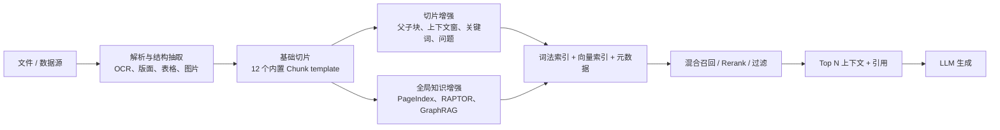

## 摘要

这是一份基于 RAGFlow v0.26.4 与 2026-07-21 官方仓库 main 的技术快照，重点梳理文档解析、12 种内置切片模板、父子块、上下文窗口、PageIndex、RAPTOR、GraphRAG、元数据增强，以及索引、混合检索和生成之间的边界。

> 调研日期：2026-07-21  
> 基线：RAGFlow 最新稳定版 **v0.26.4**（2026-07-07）及 2026-07-21 的官方仓库 `main`。版本依据见[官方 Releases](https://github.com/infiniflow/ragflow/releases/tag/v0.26.4)。  
> 来源范围：仅采用 RAGFlow 官方文档和 `infiniflow/ragflow` 官方仓库。文中把“官方文档保证的产品行为”和“当前 `main` 源码实现”分开表述。

## 一、结论先行

RAGFlow 的核心不是单一的向量切片器，而是一条“深度文档理解 + 结构感知切片 + 多路知识增强 + 混合检索”的知识处理链：



最重要的边界是：

- **解析器不是切片器**：DeepDoc、Naive、MinerU、Docling、OpenDataLoader 和第三方 VLM 主要解决 PDF 内容与结构抽取；General、Paper、Book、Laws 等模板才决定如何组织块。[PDF 解析器文档](https://github.com/infiniflow/ragflow/blob/main/docs/guides/dataset/select_pdf_parser.md)
- **RAPTOR 和 GraphRAG 不是基础切片策略**：它们都在基础块之后创建额外的摘要块或图谱块，用于多跳和全局检索。[RAPTOR 文档](https://github.com/infiniflow/ragflow/blob/main/docs/guides/dataset/advanced/enable_raptor.md)｜[知识图谱文档](https://github.com/infiniflow/ragflow/blob/main/docs/guides/dataset/advanced/construct_knowledge_graph.md)
- **索引不等于检索**：解析阶段为块生成全文字段和 embedding 并写入文档引擎；查询阶段再组合关键词匹配、向量相似度、可选 reranker、PageRank 与元数据过滤。[检索测试文档](https://github.com/infiniflow/ragflow/blob/main/docs/guides/dataset/run_retrieval_test.md)｜[检索源码](https://github.com/infiniflow/ragflow/blob/main/rag/nlp/search.py)
- **生成不负责“找知识”**：生成阶段消费已召回的 Top N 块及其来源信息。应先用 Retrieval testing 验证正确块是否能被找回，再判断问题属于检索还是 LLM 生成。[检索测试文档](https://github.com/infiniflow/ragflow/blob/main/docs/guides/dataset/run_retrieval_test.md)

## 二、知识处理方法与整体架构

### 2.1 文档解析：DeepDoc 与可替换 PDF 解析器

RAGFlow 将 PDF 数据抽取与切片方法解耦。当前可选择：

| PDF 解析器 | 主要处理 | 适用情况 | 代价与限制 |
|---|---|---|---|
| DeepDoc | OCR、表格结构识别 TSR、文档版面识别 DLR | 扫描件、复杂版面、图文混排、复杂表格 | 默认方案，但计算耗时较高 |
| Naive / Plain Text | 跳过 OCR、TSR、DLR，直接提取文本层 | 全部 PDF 均为可选中文本且布局不复杂 | 无法恢复扫描文字和复杂视觉结构 |
| MinerU | 通过远端 MinerU API 转为机器可读结构 | 希望采用 MinerU 多后端能力 | 实验性；RAGFlow 是远端客户端，需要独立服务 |
| Docling | 本地或 Docling Serve 返回 Markdown/文本 | 结构化转换、公式抽取 | 实验性；本地与远端行为取决于配置 |
| OpenDataLoader | 独立服务输出结构化 JSON / Markdown | 本地优先、确定性 PDF 处理 | 实验性 |
| 第三方视觉模型 | 用租户默认 VLM 做视觉解析 | 需要特定模型效果 | 需配置视觉模型，官方标记为实验性 |

以上选项与限制来自[官方 PDF parser 文档](https://github.com/infiniflow/ragflow/blob/main/docs/guides/dataset/select_pdf_parser.md)。

DeepDoc 本身分为 `vision` 与 `parser` 两部分：

- OCR 用于图像或扫描 PDF 的文字与坐标抽取。
- DLR 将区域识别为 Text、Title、Figure、Figure caption、Table、Table caption、Header、Footer、Reference、Equation 等布局类型，从而判断阅读顺序、表格区域和图注关系。
- TSR 识别 Column、Row、Column header、Projected row header、Spanning cell，并把复杂表格重新组装成便于 LLM 理解的句子或 HTML。
- 扫描表格支持基于 OCR 置信度的 0°、90°、180°、270°自动旋转选择。

源码与模型说明见[DeepDoc README](https://github.com/infiniflow/ragflow/blob/main/deepdoc/README.md)，解析器实现目录见[`deepdoc/parser`](https://github.com/infiniflow/ragflow/tree/main/deepdoc/parser)。

### 2.2 基础切片：结构感知模板

RAGFlow 当前官方配置文档列出 **12 个内置 Chunk template**：General、Q&A、Resume、Manual、Table、Paper、Book、Laws、Presentation、Picture、One、Tag。[官方模板矩阵](https://github.com/infiniflow/ragflow/blob/main/docs/guides/dataset/configure_knowledge_base.md)

它们不是同一切分器的一组参数预设，而是不同的解析和组织算法：

- General 按分隔符、token 上限和重叠比例合并连续段落。
- Paper、Book、Laws、Manual 利用标题、目录、编号层级或版面结构建立语义段落。
- Q&A、Table、Tag 按结构化记录切分。
- Presentation 按页切分。
- Picture 对单张图片做 OCR / VLM 描述。
- One 把整份文件作为一个块。
- Resume 抽取简历结构字段，再按语义字段形成块。

模板源码集中在[`rag/app`](https://github.com/infiniflow/ragflow/tree/main/rag/app)。

### 2.3 父子切片（Parent-child）

父子切片解决“召回需要细粒度、生成需要完整上下文”的冲突：

1. 文档先形成较大的父块，保存完整语义单元。
2. 父块按独立的 child delimiter 再拆成较小子块。
3. 检索时用子块精确匹配。
4. 命中子块后，返回关联父块供生成模型理解上下文。

当前官方文档将该机制放入 Ingestion Pipeline 的 Chunker，并允许配置子块分隔符。[父子切片文档](https://github.com/infiniflow/ragflow/blob/main/docs/guides/dataset/configure_child_chunking_strategy.md)；当前检索源码包含按父块聚合命中子块以及父块缺失时退回子块的逻辑。[检索源码](https://github.com/infiniflow/ragflow/blob/main/rag/nlp/search.py)

### 2.4 图片与表格上下文窗口

传统做法把图片或表格作为独立块，查询若只匹配周围解释文字，图片/表格可能无法召回。RAGFlow 0.23.0 起可以向图片或表格块补入其上下约 N tokens 的文本，并在标点附近优化边界。[上下文窗口文档](https://github.com/infiniflow/ragflow/blob/main/docs/guides/dataset/set_context_window.md)

这属于**块增强**，不是新的 Chunk template。它适合报告、论文、产品手册中“图表本身 + 前后解释”共同承载语义的场景。

### 2.5 自动关键词与自动问题

RAGFlow 可以把每个基础块发送给 chat model：

- Auto-keyword 为块生成关键词或同义词，加入额外检索信息；取值 0–30，官方对约 1,000 字符块建议从 3–5 开始。
- Auto-question 为块生成潜在用户问题，改善 FAQ、产品手册和政策文档中“用户问法与原文措辞不同”的匹配；取值 0–10，约 1,000 字符块建议从 1–2 开始。
- 二者都会增加索引时间与 LLM token 消耗，且收益会随数量增大而递减。

产品行为见[Auto-keyword / Auto-question 文档](https://github.com/infiniflow/ragflow/blob/main/docs/guides/dataset/advanced/autokeyword_autoquestion.mdx)，异步逐块生成逻辑见[`task_executor.py`](https://github.com/infiniflow/ragflow/blob/main/rag/svr/task_executor.py)。

这里的“自动问题”是**检索增强字段**，不同于 Q&A Chunk template：前者从任意文本块生成可能的问题，后者把原始两列表格或问答结构直接解析为“一问一答一个块”。

### 2.6 PageIndex / TOC 增强

PageIndex 在索引阶段使用 LLM 提取或生成章节目录，将章节信息附加给块；检索阶段先得到命中块，再依据目录结构补充缺失的关联块，以缓解切片导致的上下文断裂。旧文件需要重新解析才会获得该能力。[PageIndex 文档](https://github.com/infiniflow/ragflow/blob/main/docs/guides/dataset/advanced/extract_table_of_contents.md)

它与父子切片目标相近但机制不同：父子切片依靠明确的父子块关系；PageIndex 依靠文档目录结构做检索后的上下文扩展。

### 2.7 RAPTOR

RAPTOR 的处理步骤是：

1. 从已经生成的基础块开始。
2. 按 embedding 语义相似度聚类，而不是按原文顺序聚类。
3. 使用系统默认 chat model 为每个簇生成高层摘要块。
4. 对摘要块继续聚类与摘要，递归形成从叶子块到根摘要的层级树。
5. 将这些摘要块也写入索引，使查询既能命中细节块，也能命中跨段、跨章节的高层语义。

官方参数包括：`prompt`、摘要 `max_token`（默认 256、上限 2048）、聚类相似度 `threshold`（默认 0.1）、`max_cluster`（默认 64、上限 1024）和 `random_seed`。它适合长文档、多跳问题与整体摘要，但会显著增加内存、计算和 token 成本。[RAPTOR 文档](https://github.com/infiniflow/ragflow/blob/main/docs/guides/dataset/advanced/enable_raptor.md)

当前 `main` 还在任务执行器中保存 RAPTOR 层号和构建方法，并将生成摘要标记为 `raptor` 后写入文档引擎。[RAPTOR 执行源码](https://github.com/infiniflow/ragflow/blob/main/rag/svr/task_executor.py)｜[RAPTOR 算法目录](https://github.com/infiniflow/ragflow/tree/main/rag/advanced_rag/knowlege_compile/raptor)

### 2.8 GraphRAG / 知识图谱

RAGFlow 的知识图谱同样位于“基础切片之后、索引之前/并行”的知识增强层：

- 从块中抽取实体及关系，并创建额外图谱块。
- 从 v0.16.0 起按整个 dataset 构建统一图，而不是每个文件一张孤立图；新增文件解析时图会更新，但删除文件后需要重新生成图。
- `General` 方法采用 GraphRAG 提示词；`Light` 默认采用 LightRAG 提示词，资源消耗更低。
- 可配置实体类型；默认示例为 organization、person、event、category。
- 可选 entity resolution，由 LLM 合并同义或近义实体，但增加 token 消耗。
- 可选 community report，为实体社区生成摘要。

产品配置和限制见[知识图谱文档](https://github.com/infiniflow/ragflow/blob/main/docs/guides/dataset/advanced/construct_knowledge_graph.md)，实现见[`rag/graphrag`](https://github.com/infiniflow/ragflow/tree/main/rag/graphrag)。

启用图谱检索时，官方描述的查询路径是：LLM 从查询抽取实体与类型 → 依据 PageRank 取候选实体 → 用查询实体 embedding 找相似实体及 N-hop 关系 → 用查询 embedding 找相似关系 → 以 PageRank × 相似度排序 → 补充覆盖最多最终实体的 Top 1 community report。图谱生成的 entity、relationship、community report 各自是独立块，检索时主要使用向量相似度。[检索测试文档](https://github.com/infiniflow/ragflow/blob/main/docs/guides/dataset/run_retrieval_test.md)

### 2.9 元数据与标签增强

RAGFlow 支持三类不同的“附加知识”：

| 方法 | 产生方式 | 检索阶段作用 | 生成阶段作用 |
|---|---|---|---|
| 手工/自动元数据 | 文件级手工录入，或 LLM 按字段规则提取 | Automatic、Semi-automatic、Manual 三种模式过滤文档 | 被召回块所属文件的元数据可随上下文传给 LLM |
| Tag set | 上传 Description、Tag 两列表，由向量相似度给普通块打封闭集合标签 | 查询也被打标签，提高同标签块的排序机会 | 标签间接影响进入上下文的块 |
| Page rank | dataset 级手工整数 0–100 | 在混合分数后添加 dataset 优先级加成 | 不直接改变生成 |

来源：[自动元数据](https://github.com/infiniflow/ragflow/blob/main/docs/guides/dataset/advanced/auto_metadata.md)｜[元数据管理与过滤](https://github.com/infiniflow/ragflow/blob/main/docs/guides/dataset/manage_metadata.md)｜[Tag set](https://github.com/infiniflow/ragflow/blob/main/docs/guides/dataset/use_tag_sets.md)｜[Page rank](https://github.com/infiniflow/ragflow/blob/main/docs/guides/dataset/set_page_rank.md)

Tag dataset 只是给其他 dataset 的块打标签，官方明确要求不要把它直接选为 Chat 或 Agent 的检索知识库。[Tag set 文档](https://github.com/infiniflow/ragflow/blob/main/docs/guides/dataset/use_tag_sets.md)

### 2.10 自定义 Ingestion Pipeline

从 v0.21.0 起，dataset 不必只使用内置模板，也可以选择保存过的 Ingestion Pipeline，自行编排数据摄取与清洗；父子切片等能力也已经进入 pipeline 的 Chunker 组件。[Dataset 配置文档](https://github.com/infiniflow/ragflow/blob/main/docs/guides/dataset/configure_knowledge_base.md)｜[父子切片文档](https://github.com/infiniflow/ragflow/blob/main/docs/guides/dataset/configure_child_chunking_strategy.md)

它适合需要自定义解析、字段转换、过滤或特殊切片边界的场景。内置 12 个模板是产品预设，自定义 pipeline 是可编排扩展层，两者不应计为同一套“切片算法清单”。

## 三、12 个内置切片模板总览

文件兼容性以当前官方配置文档为准；“切分逻辑”结合对应 `rag/app/*.py` 当前源码。

| 模板 | 官方兼容文件 | 实际切分逻辑 | 最适合 |
|---|---|---|---|
| General (`naive`) | MD/MDX、DOCX、XLS/XLSX、PPT、PDF、TXT、图片、CSV、JSON、EML、HTML | 先按格式解析成连续 section，再按 delimiter 拆分并合并到 token 上限；支持 overlap、父子块、图片/表格上下文 | 通用非固定结构语料 |
| Q&A (`qa`) | XLS/XLSX、CSV/TXT | 一组 question + answer 形成一个块 | FAQ、客服问答、标准问答对 |
| Resume (`resume`) | DOCX、PDF、TXT | 抽取结构化简历字段，按基本信息、教育、工作、项目等语义字段成块 | 人才库、简历检索 |
| Manual (`manual`) | PDF | 利用 PDF outline 或标题/编号层级划分 section，再按同 section 合并 | 产品手册、操作手册、规程 |
| Table (`table`) | XLS/XLSX、CSV/TXT | 第一行为字段名，每一行记录成为一个块；列可区分索引文本和元数据 | 商品、供应商、配置项等结构化记录 |
| Paper (`paper`) | PDF | 提取题名、作者、摘要、表格；摘要独立加权；正文按章节标题层级合并 | 学术论文、技术白皮书 |
| Book (`book`) | DOCX、PDF、TXT | 去目录，识别冒号标题/编号层级；能识别层级时做 hierarchical merge，否则退回 token + delimiter 合并 | 书籍、教材、长章节文档 |
| Laws (`laws`) | DOCX、PDF、TXT | 去目录，识别法条编号/标题并构建层级树，按树合并 | 法律、法规、合同条款、制度 |
| Presentation (`presentation`) | PDF、PPTX | 每页/每张幻灯片为一个块，并保留页号与缩略图 | 演示文稿、培训课件 |
| Picture (`picture`) | JPEG/JPG/PNG/TIF/GIF | 单图先 OCR；短 OCR 文本再由视觉模型补描述；整张图片形成一个块 | 海报、截图、扫描图片、图表 |
| One (`one`) | DOCX、XLS/XLSX、PDF、TXT | 整份文件拼接成一个块，保持原始顺序 | 很短、不可拆分、需整体语义的文档 |
| Tag (`tag`) | XLS/XLSX、CSV/TXT | Description + Tag 每对形成标签记录，供其他 dataset 自动打标签 | 领域标签词典，不是普通知识库 |

官方兼容矩阵：[Configure dataset](https://github.com/infiniflow/ragflow/blob/main/docs/guides/dataset/configure_knowledge_base.md)。模板源码：[General](https://github.com/infiniflow/ragflow/blob/main/rag/app/naive.py)｜[Q&A](https://github.com/infiniflow/ragflow/blob/main/rag/app/qa.py)｜[Resume](https://github.com/infiniflow/ragflow/blob/main/rag/app/resume.py)｜[Manual](https://github.com/infiniflow/ragflow/blob/main/rag/app/manual.py)｜[Table](https://github.com/infiniflow/ragflow/blob/main/rag/app/table.py)｜[Paper](https://github.com/infiniflow/ragflow/blob/main/rag/app/paper.py)｜[Book](https://github.com/infiniflow/ragflow/blob/main/rag/app/book.py)｜[Laws](https://github.com/infiniflow/ragflow/blob/main/rag/app/laws.py)｜[Presentation](https://github.com/infiniflow/ragflow/blob/main/rag/app/presentation.py)｜[Picture](https://github.com/infiniflow/ragflow/blob/main/rag/app/picture.py)｜[One](https://github.com/infiniflow/ragflow/blob/main/rag/app/one.py)｜[Tag](https://github.com/infiniflow/ragflow/blob/main/rag/app/tag.py)。

## 四、逐项拆解切片策略与参数

### 4.1 General

核心算法：

1. 根据扩展名选择 DOCX、PDF、Excel、TXT、Markdown、HTML、EPUB、JSON 等解析路径。
2. PDF 先由选定 PDF parser 生成文本 section、表格、图片和位置。
3. section 按 `delimiter` 再拆分。
4. 连续片段合并，直到接近 `chunk_token_num`。
5. `overlapped_percent` 可将相邻块的部分内容重复保留。
6. `children_delimiter` 可继续生成用于召回的子块。
7. 表格和图片可以作为独立块，也可以附加周围文本窗口。

关键源码见[`naive.chunk`](https://github.com/infiniflow/ragflow/blob/main/rag/app/naive.py)与[`naive_merge`](https://github.com/infiniflow/ragflow/blob/main/rag/nlp/__init__.py)。

关键参数：

- `chunk_token_num`：目标块 token 上限；不是字符数。
- `delimiter`：句子/段落切分符，可同时包含多个符号。
- `overlapped_percent`：相邻块重叠比例。
- `children_delimiter`：父块内部生成子块的分隔符。
- `layout_recognize`：PDF 解析器/视觉模型选择，不是切片算法本身。
- `table_context_size`、`image_context_size`：表格、图片上下文 token 窗口。
- `html4excel`：是否把 Excel 表格按 HTML section 处理。
- `analyze_hyperlink`：是否进一步抓取并解析文档中的链接。

当前源码的两个实现细节需要注意：`overlapped_percent` 先按上一块的字符比例截取尾部，再重新计算 token，因此不是严格的 token-level overlap；用反引号包围的自定义 delimiter 会被视为 hard split，其边界优先于 `chunk_token_num`。Markdown 的短标题还会被主动与后续正文合并，以避免形成只有标题的块。[切分与合并源码](https://github.com/infiniflow/ragflow/blob/main/rag/nlp/__init__.py)｜[General 源码](https://github.com/infiniflow/ragflow/blob/main/rag/app/naive.py)

限制：固定 token 上限不会自动理解业务语义；分隔符不匹配文档结构时，块边界仍可能切断步骤、条款或表格说明。复杂结构优先选专用模板或自定义 Ingestion Pipeline。

### 4.2 Q&A

- XLS/XLSX、CSV/TXT 的核心输入是两列且**无表头**：question 在前、answer 在后；每对问答成为一个块。
- CSV/TXT 当前源码可识别 Tab 或逗号；格式异常行会被忽略或并入上一答案。
- 每个块把问题放入问题字段、答案放入正文，从而让用户问法获得更直接的词法和语义匹配。
- 当前源码还有 PDF、Markdown、DOCX 解析分支，但它们未进入当前公开兼容矩阵，部署时不应把这些分支视为稳定 UI 契约。

来源：[Q&A 源码](https://github.com/infiniflow/ragflow/blob/main/rag/app/qa.py)｜[官方模板矩阵](https://github.com/infiniflow/ragflow/blob/main/docs/guides/dataset/configure_knowledge_base.md)。

### 4.3 Resume

- 官方标记为企业版能力，云端可试用；兼容 DOCX、PDF、TXT。
- 当前源码按姓名、联系方式、教育、技能、证书、工作经历、项目经历等结构化字段生成语义块；工作和项目描述列表会逐项分块并附公司、时间等上下文。
- 当前开源源码明确检查文档引擎必须是 Elasticsearch。
- 适合字段检索与人才筛选，不适合普通长文档。

来源：[官方模板矩阵](https://github.com/infiniflow/ragflow/blob/main/docs/guides/dataset/configure_knowledge_base.md)｜[Resume 源码](https://github.com/infiniflow/ragflow/blob/main/rag/app/resume.py)。

### 4.4 Manual

- `Manual` 表示面向用户手册、产品手册的模板，不是让用户手工逐块切片。
- PDF 优先读取原生 outlines；若 outline 与正文 section 的覆盖比例足够，则按 outline 深度给 section 分级。
- 没有可靠 outline 时，改用 bullet / title frequency 推断标题等级。
- 同一 section 的内容会连续合并；当前源码用约 32 tokens 作为最小合并保护，并允许同 section 继续合并至约 1,024 tokens。
- 表格独立 token 化，且可追加表格/图片上下文窗口。

适合有目录、章节、步骤结构的操作手册。对缺乏标题、OCR 顺序错误或目录识别不准的 PDF，结构收益会明显下降。[Manual 源码](https://github.com/infiniflow/ragflow/blob/main/rag/app/manual.py)

### 4.5 Table

- 第一行必须是有意义的列名；每一数据行成为一个块。
- 列名可写同义词与枚举，例如 `supplier/vendor`、`gender/sex(male,female)`，帮助词法理解。
- 当前源码会推断列类型，并支持把列角色设为 indexing/vectorize、metadata 或 both：索引列拼成正文，metadata 列保存为结构化字段。
- XLS/XLSX 支持多 sheet；CSV/TXT 支持指定分隔符；列数不一致的行会跳过。

它适合“一行一个实体”的数据。合并单元格、跨行表头、正文内嵌表格则更适合先用 DeepDoc TSR 或外部解析器恢复结构。[Table 源码](https://github.com/infiniflow/ragflow/blob/main/rag/app/table.py)｜[DeepDoc TSR](https://github.com/infiniflow/ragflow/blob/main/deepdoc/README.md)

### 4.6 Paper

- 提取并单独索引论文 title、authors、abstract、tables、sections。
- Abstract 形成独立块，并增加 `abstract / summary / summarize` 等重要关键词。
- 正文通过 bullet 类型与标题频率推断章节 pivot；同一章节的连续 section 合并为块。
- 不主要依赖 `chunk_token_num` 做硬切分，因此章节异常长时要检查块大小。

适合结构规范的论文；海报、扫描讲义或没有稳定章节标题的资料通常更适合 General / Presentation。[Paper 源码](https://github.com/infiniflow/ragflow/blob/main/rag/app/paper.py)

### 4.7 Book

- 支持 DOCX、PDF、TXT；长书可通过 page range 限定解析范围。
- 尝试删除目录，并将冒号结尾等模式转为标题线索。
- 若能识别主要 bullet / 标题层级，则采用 `hierarchical_merge` 形成章节块；否则退回 General 风格的 token + delimiter 合并。
- 表格独立建块，并支持图片/表格上下文窗口。

适合章节层级明显的书籍。对于超长书，应先按卷/章或页范围拆数据集，再评估 RAPTOR 或 PageIndex，避免单次解析与摘要成本失控。[Book 源码](https://github.com/infiniflow/ragflow/blob/main/rag/app/book.py)

### 4.8 Laws

- 删除目录，识别法条编号、标题与冒号标题。
- 使用 `bullets_category` 确定层级模式，再用 `tree_merge(..., 2)` 把父级标题和下级条款组织为树状块。
- v0.26.4 修复了“带点数字的交叉引用被错误识别为标题”的问题，说明法条编号识别是该模板的核心边界。[v0.26.4 Release](https://github.com/infiniflow/ragflow/releases/tag/v0.26.4)

适合法规、政策、合同与制度；但不同国家、行业的条款编号习惯不同，必须用真实查询做 retrieval test。[Laws 源码](https://github.com/infiniflow/ragflow/blob/main/rag/app/laws.py)

### 4.9 Presentation

- 每一页/幻灯片单独形成一个块，保存页号和页面缩略图。
- 这种策略保持视觉页面边界，适合一页表达一个主题的 PPT。
- 如果一页内容极少或同一论证跨很多页，单页块会造成语义碎片；可用图片/表格上下文、PageIndex 或在自定义 pipeline 中合并连续页。

来源：[Presentation 源码](https://github.com/infiniflow/ragflow/blob/main/rag/app/presentation.py)。

### 4.10 Picture

- 一张图片形成一个块并保留图片对象。
- 先尝试配置的 PaddleOCR，否则回退到本地 DeepDoc OCR。
- 当前源码中，OCR 文本较长时直接用 OCR 文本；较短时调用默认视觉模型生成图片描述并附加到 OCR 文本。
- 因此 Picture 的语义质量高度依赖 OCR 与视觉模型，不存在普通文本切片的 token-size 调优。

来源：[Picture 源码](https://github.com/infiniflow/ragflow/blob/main/rag/app/picture.py)。

### 4.11 One

- 将解析得到的 section、表格等按原始顺序拼接，整份文件只返回一个块。
- 优点是绝不丢失跨段上下文；缺点是 embedding 只能代表整份文件，长文件还可能超过 embedding 或 LLM 的有效上下文。
- 只适合短文、单记录、完整性比定位精度更重要的文件。

来源：[One 源码](https://github.com/infiniflow/ragflow/blob/main/rag/app/one.py)。

### 4.12 Tag

- 表格为 Description、Tag 两列；Description 可以是示例块或失败查询，Tag 可为逗号分隔的多个标签。
- 每个 Description + Tag 对成为标签记录。
- 普通 dataset 重解析时，每个块与 tag set 条目比较相似度并获得封闭集合标签；查询也会被映射标签，从而提升匹配标签块的排序。
- Tag dataset 本身不应作为 Chat/Agent 的检索 dataset。

来源：[Tag set 文档](https://github.com/infiniflow/ragflow/blob/main/docs/guides/dataset/use_tag_sets.md)｜[Tag 源码](https://github.com/infiniflow/ragflow/blob/main/rag/app/tag.py)。

## 五、索引、检索与生成：不要和切片混为一谈

### 5.1 索引阶段

基础切片和增强完成后，当前任务执行器会：

1. 为正文生成 `content_ltks` 和更细粒度的 `content_sm_ltks` 等词法字段。
2. 可选地生成 `important_kwd`、question fields 和 metadata。
3. 用 dataset 固定的 embedding model 批量编码正文。
4. 按向量维度写入类似 `q_{dimension}_vec` 的字段。
5. 把全文字段、向量、页码/坐标、图片、标签、元数据及增强块写入文档引擎。

官方要求同一 dataset 中已有块时不能直接切换 embedding model；必须删除现有块，以保证处于同一向量空间。[Dataset 配置文档](https://github.com/infiniflow/ragflow/blob/main/docs/guides/dataset/configure_knowledge_base.md)

RAGFlow 默认用 Elasticsearch 存全文与向量，也可以配置 Infinity；知识图谱生成的块同样存于 Elasticsearch 或 Infinity。[官方仓库 README](https://github.com/infiniflow/ragflow#switch-doc-engine-from-elasticsearch-to-infinity)｜[知识图谱文档](https://github.com/infiniflow/ragflow/blob/main/docs/guides/dataset/advanced/construct_knowledge_graph.md)

实际 embedding、批量写入与索引流程见[`task_executor.py`](https://github.com/infiniflow/ragflow/blob/main/rag/svr/task_executor.py)。

### 5.2 检索阶段

普通块的默认思路是 hybrid retrieval：

```text
若无 reranker：
最终相关性 ≈ 关键词相似度 × (1 - vector_weight)
           + 向量余弦相似度 × vector_weight

若有 reranker：
最终相关性 ≈ 关键词相似度 × (1 - vector_weight)
           + reranker 分数 × vector_weight
```

当前官方默认说明为 similarity threshold 0.2、vector similarity weight 0.3；低于阈值的块过滤。启用 reranker 会显著增加延迟。[Retrieval testing](https://github.com/infiniflow/ragflow/blob/main/docs/guides/dataset/run_retrieval_test.md)

源码还会在词法评分中提高 title、important keyword、question 等字段的权重，并叠加 PageRank 等 rank feature。[检索源码](https://github.com/infiniflow/ragflow/blob/main/rag/nlp/search.py)｜[查询与 token similarity 源码](https://github.com/infiniflow/ragflow/blob/main/rag/nlp/query.py)

可选检索增强包括：

- 元数据 Automatic / Semi-automatic / Manual 过滤。
- Cross-language search：用默认 chat model 把查询翻译到选定目标语言后检索。
- 父子块：子块匹配，父块回传。
- PageIndex：命中后补充目录关联块。
- RAPTOR：同时召回高层摘要和叶子细节。
- GraphRAG：单独检索实体、关系和 community report。

来源：[元数据过滤](https://github.com/infiniflow/ragflow/blob/main/docs/guides/dataset/manage_metadata.md)｜[Retrieval testing](https://github.com/infiniflow/ragflow/blob/main/docs/guides/dataset/run_retrieval_test.md)。

### 5.3 生成阶段

生成模型只消费检索后选出的上下文、图片/表格和来源信息，并合成答案。切片策略会间接决定生成质量，但生成模型不能稳定修复以下问题：

- 原文未被正确 OCR 或表格结构已丢失。
- 正确内容被切散且没有父块、PageIndex 或上下文窗口。
- embedding 或关键词检索没有召回正确块。
- metadata filter 错误地排除了正确文件。
- Top N 太小，跨多个块的证据没有完整进入上下文。

因此排障顺序应为：**解析预览 → 块内容与边界 → retrieval test → 检索分数/过滤 → 最后检查 prompt 与生成模型**。官方也建议在配置 Chat 前先做检索测试。[Retrieval testing](https://github.com/infiniflow/ragflow/blob/main/docs/guides/dataset/run_retrieval_test.md)

## 六、切片策略选择建议

| 数据特征 | 首选 | 可叠加增强 | 不建议 |
|---|---|---|---|
| 混合格式企业文档 | General | 父子块、metadata、auto-question | 一开始就开全部 GraphRAG/RAPTOR |
| 扫描 PDF / 图文报告 | General + DeepDoc | 图表上下文窗、PageIndex | Naive PDF parser |
| 规范 FAQ | Q&A | auto-keyword、metadata | 把问答表按 General 重新切 |
| 一行一个商品/实体 | Table | 列角色、metadata filter | One |
| 论文 | Paper | 图表上下文、PageIndex、RAPTOR | 纯固定字符切分 |
| 书籍/教材 | Book | PageIndex；复杂多跳再评估 RAPTOR | One |
| 法规/合同 | Laws | metadata、父子块、少量 auto-keyword | 仅按 token 随机切断法条 |
| PPT | Presentation | 视觉解析、连续页上下文 | One（长 PPT） |
| 图片库 | Picture | 高质量 OCR/VLM、metadata | 只依赖文件名 embedding |
| 极短且不可拆文档 | One | metadata | 长书、长报告 |
| 领域消歧 | 原模板 + Tag set | auto-keyword | 把 Tag dataset 直接用于回答 |

建议的调优顺序：

1. 先抽取 20–50 个真实文件，人工检查解析顺序、表格、图片和 OCR。
2. 根据文档结构选专用模板，不要先调 embedding 掩盖错误切片。
3. 建立包含命中块标注的真实问题集，观察 Recall@K 和错误类型。
4. 先调 delimiter、chunk token、overlap 或父子块。
5. 再调 metadata、auto-question / keyword、hybrid 权重、threshold、Top N 和 reranker。
6. 只有明确存在跨章节、多跳问题时，再投入 PageIndex、RAPTOR 或 GraphRAG。

以上为基于官方机制的工程建议，不是 RAGFlow 官方固定配置。

## 七、成本与限制

- DeepDoc、视觉模型、RAPTOR、GraphRAG、PageIndex、自动元数据、auto-keyword 和 auto-question 都可能显著增加计算、内存、索引时间或 LLM token 成本；不要把它们默认全开。[DeepDoc](https://github.com/infiniflow/ragflow/blob/main/deepdoc/README.md)｜[RAPTOR](https://github.com/infiniflow/ragflow/blob/main/docs/guides/dataset/advanced/enable_raptor.md)｜[GraphRAG](https://github.com/infiniflow/ragflow/blob/main/docs/guides/dataset/advanced/construct_knowledge_graph.md)
- embedding model 一旦 dataset 已有块便不能直接切换；切换需要删除并重建块。[Dataset 配置](https://github.com/infiniflow/ragflow/blob/main/docs/guides/dataset/configure_knowledge_base.md)
- GraphRAG 删除文件后不会自动清理相关图结构，必须重新生成；官方也暂不支持导出图谱。[GraphRAG 文档](https://github.com/infiniflow/ragflow/blob/main/docs/guides/dataset/advanced/construct_knowledge_graph.md)
- Tag set 更新后，普通 dataset 需要重新解析才能更新已有块标签。[Tag set 文档](https://github.com/infiniflow/ragflow/blob/main/docs/guides/dataset/use_tag_sets.md)
- PageIndex、自动元数据等索引期增强，对已解析文件通常需要重新解析才生效。[PageIndex](https://github.com/infiniflow/ragflow/blob/main/docs/guides/dataset/advanced/extract_table_of_contents.md)｜[Auto metadata](https://github.com/infiniflow/ragflow/blob/main/docs/guides/dataset/advanced/auto_metadata.md)
- Resume 当前源码仅支持 Elasticsearch，且产品矩阵标为企业版。[Resume 源码](https://github.com/infiniflow/ragflow/blob/main/rag/app/resume.py)

## 八、版本差异与未确认项

1. **General 默认块大小口径不完全统一**：当前 `main` 的 `rag/app/naive.py` 中同时出现 `parser_config` 默认 512 和局部 merge 回退 128；历史 API 文档还出现过 256。有效值可能由前端、API 初始化和文件级配置提前写入。生产环境应显式设置 `chunk_token_num`，不要依赖隐式默认。[General 源码](https://github.com/infiniflow/ragflow/blob/main/rag/app/naive.py)
2. **Q&A 源码支持面大于公开兼容矩阵**：当前源码包含 PDF、Markdown、DOCX 分支，但 v0.26.4 配置文档只保证 XLS/XLSX、CSV/TXT。报告按公开矩阵作为稳定产品口径。[Q&A 源码](https://github.com/infiniflow/ragflow/blob/main/rag/app/qa.py)｜[官方模板矩阵](https://github.com/infiniflow/ragflow/blob/main/docs/guides/dataset/configure_knowledge_base.md)
3. **源码目录还包含 `email.py`、`audio.py` 等处理模块**，但当前官方 Chunk template 下拉矩阵没有把 Email 或 Audio 列为独立模板；General 已明确支持 EML，Picture 当前源码还包含视频路径。本报告只把官方矩阵中的 12 项计为“内置 Chunk template”。[`rag/app` 目录](https://github.com/infiniflow/ragflow/tree/main/rag/app)
4. **`main` 比 v0.26.4 更新**：`main` 可能包含下一 nightly 的实现。涉及可复现部署时，应改用对应 release tag 的源码链接锁定版本，而不是长期引用 `main`。[v0.26.4 tag](https://github.com/infiniflow/ragflow/tree/v0.26.4)
5. **父子切片当前以分隔符为核心**：源码为 child 保存父文本关联，但没有独立的 child token size 或 child overlap 参数。复杂子块大小控制需要自定义 Ingestion Pipeline 或预处理。[切分/tokenize 源码](https://github.com/infiniflow/ragflow/blob/main/rag/nlp/__init__.py)

## 九、主要第一方来源

- [RAGFlow 官方仓库](https://github.com/infiniflow/ragflow)
- [v0.26.4 Release](https://github.com/infiniflow/ragflow/releases/tag/v0.26.4)
- [Dataset 配置与 12 个 Chunk template](https://github.com/infiniflow/ragflow/blob/main/docs/guides/dataset/configure_knowledge_base.md)
- [PDF parser 选择](https://github.com/infiniflow/ragflow/blob/main/docs/guides/dataset/select_pdf_parser.md)
- [DeepDoc 架构](https://github.com/infiniflow/ragflow/blob/main/deepdoc/README.md)
- [RAPTOR](https://github.com/infiniflow/ragflow/blob/main/docs/guides/dataset/advanced/enable_raptor.md)
- [GraphRAG / Knowledge graph](https://github.com/infiniflow/ragflow/blob/main/docs/guides/dataset/advanced/construct_knowledge_graph.md)
- [父子切片](https://github.com/infiniflow/ragflow/blob/main/docs/guides/dataset/configure_child_chunking_strategy.md)
- [PageIndex](https://github.com/infiniflow/ragflow/blob/main/docs/guides/dataset/advanced/extract_table_of_contents.md)
- [自动关键词与问题](https://github.com/infiniflow/ragflow/blob/main/docs/guides/dataset/advanced/autokeyword_autoquestion.mdx)
- [Metadata](https://github.com/infiniflow/ragflow/blob/main/docs/guides/dataset/manage_metadata.md)
- [Retrieval testing](https://github.com/infiniflow/ragflow/blob/main/docs/guides/dataset/run_retrieval_test.md)
- [12 个模板实现目录](https://github.com/infiniflow/ragflow/tree/main/rag/app)
- [索引任务执行器](https://github.com/infiniflow/ragflow/blob/main/rag/svr/task_executor.py)
- [检索与混合评分](https://github.com/infiniflow/ragflow/blob/main/rag/nlp/search.py)

## 相关笔记

- [[Dify 核心功能与能力调研]]
- [[Agentic RAG 六步工作流]]
