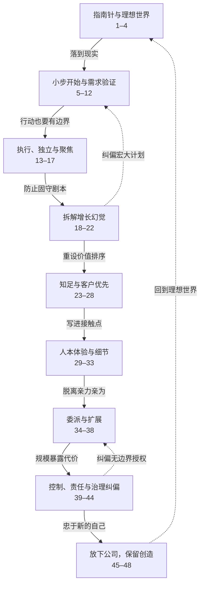

## 摘要

《Anything You Want》不是一套普遍适用的创业公式，而是 Derek Sivers 经营 CD Baby 十年后得到的一组个人经验。全书的核心命题是：**商业是帮助具体的人、实践个人价值观并创造理想生活的工具，而不是一个必须服从融资、增长和利润最大化的独立目的。**

这不是“只凭喜好做生意”，也不是反对盈利、增长或管理。Sivers 同时强调市场验证、可持续收费、流程扩容、清晰责任和结果核实：个人自主需要客户需求校验，慷慨需要可持续的商业结构，授权需要治理边界，增长必须服务而不能取代使命。

> 精读来源：[《随心所欲（Anything You Want）》中文译本](https://anything-you-want.01mvp.com/)，全文共 48 章。以下按章节分开阅读、概述和小结，再统一梳理章节间的关系。

## 全书结构

## 逐章精读

### 01 一小时的十年经验

- **核心概述**：Derek Sivers 说明，本书浓缩了他从 1998 年到 2008 年把一个小爱好意外做成大生意、最终以 2200 万美元出售的十年经验。书中既会讲他采取过的做法，也会坦承严重的错误；这些经验只是一个非常规个体的选择，并非适合所有人的普遍答案。他希望读者从中获得启发，也欢迎读者质疑和反驳，因为他把自己定位成仍在学习的学生，而不是传授真理的大师。
- **本章小结**：这本书提供的是一份诚实、可争辩的个人经验样本，而不是一套必须照做的成功公式。

### 02 你的指南针是什么？

- **核心概述**：作者认为，许多人并未主动选择人生方向，而是在模仿他人、追逐别人灌输的目标，最终可能发现这些目标并不能带来幸福。因此，一个人需要明确自己的个人哲学：什么让自己幸福，什么真正值得去做。作者随后列出贯穿其创业故事的原则，包括商业应帮助梦想成真、公司可以成为自己设计的理想世界、不要只为钱做事、从真实求助出发、通过改进和创造获得成功，以及最终只做让自己快乐的事。
- **本章小结**：经营事业之前，先确定自己的价值指南针，因为它决定了何谓成功以及应当如何取舍。

### 03 只是卖我的CD

- **核心概述**：1997 年，27 岁的 Sivers 已经靠音乐全职生活，并无创业打算；他只是想把自己的 CD 放到网上销售。由于大型网店只接受通过传统经销商进入体系的唱片，而这一体系付款慢、门槛高且不利于独立音乐人，他决定自行搭建网店。即使当时在线支付和建站都非常困难，他仍花钱申请信用卡商户账户、自学编程做出了购买按钮；随后从帮助一位朋友开始，不断答应更多音乐人的请求，使一个私人解决方案逐渐变成了事实上的业务。
- **本章小结**：CD Baby 并非由宏大的创业计划催生，而是从解决自己的具体问题、再持续帮助别人中自然长出来的。

### 04 让梦想成真

- **核心概述**：随着代卖 CD 占用越来越多时间，Sivers 意识到自己无意间创办了一家公司，但他不想让公司破坏自己作为全职音乐人的理想生活，于是刻意以“小而理想”的方式设计它。他站在音乐人的角度提出四条发行原则：每周付款、把购买者信息交给音乐人、不因销量低而下架，以及不允许付费置顶；这四点成为 CD Baby 的使命，并被反复传达给合作者。作者由此把公司理解为一个可以自行制定规则的小宇宙：创业是在创造自己的乌托邦，而满足自己的真实理想，也可能同时让他人的梦想成真。
- **本章小结**：公司的使命可以从“理想世界里这件事该怎样运作”出发，用清晰规则把个人价值观变成他人也能受益的现实。

### 05 只有两个数字的商业模式

- **核心概述**：作者并不知道该如何为 CD Baby 定价，于是直接借鉴当地唱片店的寄售模式：音乐人自行定价，平台每卖出一张 CD 固定收取 4 美元。考虑到上架一张专辑需要约四十五分钟，他又设置了最初 25 美元、后来提高到 35 美元的上架费。此后的六年中，尽管公司营收达到一千万美元，收入模式仍只有“35 美元上架费”和“每张抽成 4 美元”这两个数字；作者由此主张，早期商业计划应当简单到可以凭常识迅速判断是否成立。
- **本章小结**：一个好商业模式的起点不必复杂，只需用少数清晰数字覆盖成本并形成可持续收入。

### 06 这可不是革命

- **核心概述**：CD Baby 成功后，媒体称作者在音乐行业掀起了“革命”，但作者指出，“革命”往往只是成功以后别人追加的标签。在事情发生时，做出不同选择的人看起来更像怪人，而非革命者。若预先期待真爱、使命或变革都必须以戏剧性的方式出现，就容易忽略缓慢成长的关系、每天持续吸引自己的小事，以及单纯把服务做得更好；真正了不起的事情，在实践者看来往往只是“不寻常的常识”。
- **本章小结**：真正的变革未必声势浩大，它常常只是长期坚持一种不同寻常但切实有效的常识。

### 07 如果不是热门，就换方向

- **核心概述**：作者回顾自己曾花十二年费力推销各种项目，却始终像在逆风推一扇扇锁着的门；直到做出人们真正想要的东西，需求才开始主动涌来，产品仿佛能够自我推广。他因此修正了对“坚持”的理解：成功来自持续改进和创新，而不是持续原样推动无效之事。每个新想法或改进都应交给市场检验；只有当多人表现出强烈需要并愿意付费时才值得继续，否则就应停止追逐，再去改进或换方向。
- **本章小结**：应当坚持探索和迭代，而不是执着于一个得不到市场热烈回应的具体方案。

### 08 没有“可以”。要么“太棒了！”，要么“不行”。

- **核心概述**：作者给经常过度承诺、分身乏术的人提出一条简单规则：面对邀请、请求或新项目，如果内心的反应没有达到“太棒了，绝对要做”的程度，就直接拒绝。拒绝大多数只是“还可以”的事情，才能在生活中腾出时间和注意力，全身心投入少数真正令人兴奋的事情。由于每个人都很忙、承担得太多，减少承诺才是摆脱过载的办法。
- **本章小结**：用强烈的热情作为承诺门槛，以果断拒绝保护自己对少数重要事情的专注。

### 09 就这样，我的计划彻底改变了

- **核心概述**：CD Baby 最初只是作者为音乐人提供的信用卡收款服务，但一位客户误把它当成唱片商店，使作者意识到平台还能帮助陌生人发现并购买独立音乐，于是改变了业务方向。五年后，苹果邀请 CD Baby 担任数字发行商，作者又顺应机会调整了计划。这两次转向说明，新事业的真实形态往往不是由创始人预先设计出来的，而是在与客户和外部机会接触后逐渐显现。
- **本章小结**：创业计划不是不可更改的蓝图，而是需要在真实客户反馈面前持续修正的假设。

### 10 没有融资的优势

- **核心概述**：作者认为，没有投资者使 CD Baby 能把全部精力放在客户和自己真正重视的事情上，而不是融资轮次、办公室、团队规模或技术排场。资金匮乏也迫使他亲自学习编程、低成本搭建设施，并用“是否真正改善客户体验”来审视每一笔投入。业务增长并不来自刻意追求规模，而来自让现有客户惊喜，并由他们主动传播。
- **本章小结**：不融资可以成为一种战略约束：它迫使企业节俭、独立，并始终围绕客户创造价值。

### 11 现在就动手。无需资金。

- **核心概述**：作者质疑“必须先筹钱才能开始”的说法，认为这常常意味着人更迷恋宏大构想，而非真正做有用的事。任何宏大愿景都可以先缩小到百分之一，以一个简陋原型为真实的人解决真实问题，再从反馈中成长；学校、推荐服务和航空公司的例子都展示了这种做法。CD Baby 的第一版也只有最基本的商品列表、购买按钮和邮件收单功能，却只花 500 美元便很快实现盈利。
- **本章小结**：先用最小可行方式解决一个真实问题，比等待资金、资历或完美条件更能让想法成为事业。

### 12 合作商业模式：分享你拥有的一切

- **核心概述**：作者把自己的商业模式概括为：先找出自己拥有而别人需要的资源、技能或渠道，再尽可能分享；若分享需要持续投入，就收取足以维持服务的费用。他列举版权表格、商标注册说明、UPC 条形码、信用卡商户账户和网站托管等案例，说明这些项目一开始都只是帮助朋友或公开已有知识，后来才因需求扩大而收费并形成可观收入。商业机会因此不是凭空构想出来的，而可以从持续、有用的分享中自然生长。
- **本章小结**：一种务实的创业起点，是分享自己已有且他人需要的东西，并通过合理收费让分享得以持续。

### 13 想法只是执行力的乘数

- **核心概述**：作者用“想法 × 执行力”的模型说明，商业成果不是由创意单独决定的：想法只提供倍率，执行才构成真正的价值基础。即使是绝妙的点子，没有执行也几乎一文不值；只有高质量的创意与出色执行结合，才可能产生巨大的商业价值。因此，与其保护、炫耀或讨论一个尚未落地的想法，不如用实际行动证明它。
- **本章小结**：点子不是资产，能把点子持续做出来的执行力才是。

### 14 繁文缛节利用恐惧。勇敢拒绝。

- **核心概述**：作者以 CD Baby 早期没有律师、法律套话和成套企业制度的经历，质疑企业照搬“标准做法”的必要性。他认为，许多法律、培训和管理服务会用极端风险激发经营者的恐惧，再把自己的产品包装成必需品。企业应根据实际需要判断，而不是因为规模增长或最坏情境的威吓，就自动接受无助于客户与业务的公司化程序。
- **本章小结**：不要让对罕见风险的恐惧替你决定企业需要什么。

### 15 许多小客户的力量

- **核心概述**：作者反对把企业命运押在少数大客户身上，因为大客户会要求定制、可能随人员变动而离开，并凭借收入占比事实上控制供应商。由大量小客户组成的业务更分散风险，也让经营者不必为单一客户扭曲产品或工作方式。广泛听取许多人的反馈，还能让企业更接近多数用户的真实需求，并保留从容告别个别不合适客户的自由。
- **本章小结**：分散的客户结构不仅降低风险，也保护企业的判断权与独立性。

### 16 自豪地排除他人

- **核心概述**：作者指出，试图满足所有人的企业往往难以形成清晰定位，也难以获得真正的关注。企业应明确表达“我们不服务谁”，用主动排除来证明自己对目标客户的重视。CD Baby 拒绝大唱片公司艺人入驻，正是为了把有限的曝光留给独立音乐人；排除广大的非目标人群，反而会增强少数目标用户的认同与信任。
- **本章小结**：清晰地拒绝不属于目标的人，是对真正目标客户最有力的承诺。

### 17 为什么不做广告？

- **核心概述**：面对在 CD Baby 网站上投放横幅广告的提议，作者直接拒绝，因为公司的目的不是榨取每一种获利机会，而是帮助音乐人。收费只是让服务得以持续运转的手段，赚钱并非判断一件事是否值得做的最高标准。作者给出的检验方式很简单：如果理想中的服务不需要广告、顾客也从未要求增加广告，就不该仅因它能赚钱而加入。
- **本章小结**：商业应让收入服务于使命，而不是让使命屈从于额外收入。

### 18 而只要那百分之一的人……

- **核心概述**：一位音乐人把杂志的百万发行量直接换算成“只要百分之一购买，就能卖出一万张”，并据此提前生产、采购包装材料、改造车库。真实结果却只有四份订单，因为他把一个乐观比例当成了必然下限，却没有验证读者是否会注意广告、产生兴趣并实际购买。这个故事提醒人们，大市场和小转化率相乘得到的漂亮数字，并不等于真实需求。
- **本章小结**：不要把“只需获得很小比例的庞大市场”当成保守预测，市场反馈可能远低于你能想象的比例。

### 19 这只是众多选择之一

- **核心概述**：作者从声乐老师的训练中学到：一种自以为正确、自然的唱法，其实只是许多可选方案中的一个；改变音高、速度、风格和情境，会暴露更多表达可能。商业计划同样不应只有一条路径，应通过改变预算、客户规模、渠道乃至核心假设，强迫自己制定多个截然不同的版本。这样做不是为了准确预测未来，而是为了摆脱对第一个想法的依赖，在变化中获得更强的判断力和适应性；人生道路也同样存在多种可行版本。
- **本章小结**：把第一种方案当成众多可能之一，主动改变约束并重做计划，才能看见真正的选择空间。

### 20 你不需要计划或愿景

- **核心概述**：作者用自己严重低估 CD Baby 未来规模的旧邮件说明，人很难准确设想企业会发展到何种程度：他曾把一千位音乐人和三名员工视为宏大未来，后来公司却服务了十万位音乐人并拥有八十五名员工。因此，没有颠覆行业的远大蓝图并不可耻，真实发展可以远远超出最初的想象。与其编造二十年后的宏伟目标，不如专注于今天人们真正需要什么，并在当下提供帮助。
- **本章小结**：你不必先拥有宏大愿景，持续解决人们今天的真实需要就足以推动事业前进。

### 21 你如何给自己打分？

- **核心概述**：每个人判断自己是否成功的标准并不相同：有人看财富，有人看捐赠，有人看影响的广度或深度。作者选择用“创造了多少既有用、又包含自己创意投入的东西”衡量自己；仅仅有用或仅仅有创意，都不满足他的标准。及早明确自己的计分方式，能让人把精力放在真正重要的事上，而不是被他人的成功定义牵着走。
- **本章小结**：先定义属于自己的成功标准，才能有意识地活在自己的价值排序里。

### 22 我怀念黑手党

- **核心概述**：作者借拉斯维加斯出租车司机的故事说明：只关注“进来的钱多于出去的钱”尚能给经营留出乐趣，而企业式的精细化管理和逐项榨取利润，反而可能把体验中的人情味消耗殆尽。面对要求分析增长率、留存收益和预测的 MBA 式追问，作者坚持 CD Baby 的存在理由只是帮助音乐人，同时让自己和顾客都开心；只要在帮助人、双方开心且仍有盈利，就未必需要继续最大化。
- **本章小结**：商业指标应服务于创办事业的初衷，而不该以利润最大化取代初衷。

### 23 你慷慨得起

- **核心概述**：优质服务来自安稳、富足的心理：相信自己拥有足够多，才愿意免费续杯、开放洗手间、投入时间回答问题，也愿意退款、给予关注或承担一点损失。糟糕服务则往往源于匮乏和求生心态，人会为了守住眼前利润而牺牲长期判断。慷慨不仅是态度，也是精明的长期策略，因为眼前少赚一点可能换来顾客多年的忠诚与口碑传播。
- **本章小结**：以富足心态主动多给一点，既能创造更好的服务，也能积累长期信任。

### 24 关心客户胜过关心自己

- **核心概述**：当有人担心音乐人自己开店会令 CD Baby 消亡时，作者回答：如果音乐人不再需要它，关闭公司反而是好事，因为公司只是服务音乐人的手段，而不是目的。企业原本为解决问题而生，却可能因自我保存而希望问题持续存在，从而让收费的“解药”压过真正的预防。作者因此提出最彻底的客户导向：公司应当准备为了真正解决客户问题而牺牲自身。
- **本章小结**：真正的客户第一，是把客户的问题是否解决置于公司的存续之上。

### 25 就像你不需要那笔钱

- **核心概述**：商业中的“需要感”会被人感知：越显得急于赚钱，越容易像绝望的追求者一样令人退避。相反，若因热爱而做事，以慷慨代替吝啬、以信任代替恐惧，顾客会更愿意回馈。作者因此主张，把生意经营得像并不需要钱，钱反而更可能主动到来。
- **本章小结**：先以热爱和慷慨创造价值，而不是焦虑地索取回报，商业回报往往会随之而来。

### 26 客户服务就是一切

- **核心概述**：CD Baby 被音乐人选择，首要原因并非价格、功能或设计，而是能迅速联系到愿意回应的真人。作者据此把客户服务视为与销售同等重要的利润中心，而非必须压缩的成本，并将大量员工投入其中。相比不断拉新，让现有客户持续感到兴奋和被重视，是更划算的长期投资。
- **本章小结**：客户服务不是后台开支，而是形成差异化、留住客户并创造利润的核心业务。

### 27 每一次互动都是你闪耀的时刻

- **核心概述**：主动联系公司的潜在客户只是少数，因此每次联系都是塑造品牌印象的高价值时刻。作者反对把客服训练成只求快速结案，主张花几分钟认识对方、了解其作品，并给予真诚关注。像对待自己最喜欢的明星那样对待每位来访者，既能留下难忘体验，也会让工作和生活本身更有趣。
- **本章小结**：不要把客户互动当成待清理的工单，而应把它当作让一个人真正感到被看见的机会。

### 28 输掉每一场架

- **核心概述**：面对不满客户时，即使确信对方有错，也应主动“输掉”争论，以谦卑、慷慨和解决问题的意愿取代反击。客服沟通没有真正的私下场合，任何话都可能公开传播，因此企业必须始终展现最好的一面。那些大声抱怨的人也可能在被妥善对待后成为大声赞美公司的传播者，所以投诉不是单纯的威胁，而是修复关系和赢得拥护者的机会。
- **本章小结**：放弃证明自己正确，优先让客户重新开心，才可能把冲突转化为信任与口碑。

### 29 不要因为一个人的错误惩罚所有人

- **核心概述**：企业主在遭遇个别顾客或员工的恶劣行为后，很容易出于愤怒制定一条面向所有人的限制性政策；但这种政策往往让无辜的大多数长期承担代价。作者用餐馆警示牌、学校禁果汁、机场脱鞋和公司防火墙说明：针对孤例的过度反应会把偶发问题固化成普遍惩罚。更好的做法是先冷静、看清整体比例，接受坏事无法被彻底杜绝，而不要把一个人的过错投射到所有人身上。
- **本章小结**：不要让一次受伤后的愤怒，变成长期伤害所有好顾客与好员工的制度。

### 30 一个真实的人，和你很像

- **核心概述**：作者通过两组故事展示线上沟通如何遮蔽人的真实感：一位顾客随手写下的恶毒邮件让小店主几乎崩溃，而约会网站上的收信者也能轻易删掉别人认真写下的心意。屏幕让人误以为自己面对的是网站、公司或一批可替换的账号，而不是一个有生活、希望和脆弱之处的具体的人。因此，线上说话和回应他人时，也应保持面对面交流时才会有的同理心与克制。
- **本章小结**：每块屏幕背后都是会被你的话真正影响的一个人，应当以对待真人的方式沟通。

### 31 不清晰时，你应当感到痛苦

- **核心概述**：在 CD Baby 面向约 200 万客户发邮件时，任何含糊都会立即转化成数万封询问、团队一周的额外劳动、至少 5000 美元损失和士气下降，这种代价迫使作者反复删词、改句。相比之下，网站文案不清晰通常只得到沉默——用户访问后不行动——因此写作者很难感知自己的失败。作者借此批评用大量空洞语言营造“高大上”形象，强调清晰、简短和不可误解比虚浮的表达更重要。
- **本章小结**：把含糊当成有真实成本的错误，才能逼迫自己写出简洁而清晰的表达。

### 32 我写过最成功的一封邮件

- **核心概述**：作者认为，创业是在建造一个由自己制定规则的小世界，因此每个细节都可以体现企业“本该有的样子”。为落实 CD Baby“让人微笑”的使命，他把普通的发货通知改成一封夸张、幽默的幻想故事；这封只花二十分钟写成的邮件被顾客大量转载，并带来成千上万的新客户。这个案例说明，增长不一定来自宏大计划，能准确承载使命、触发情感并值得讲述的小细节，反而可能产生强大的口碑传播。
- **本章小结**：让使命进入一个令人愉快、值得转述的小细节，往往比宏大的增长方案更能打动人并带来传播。

### 33 小细节带来大不同

- **核心概述**：CD Baby 最令人难忘的竞争力，并不是宏大的商业模式，而是倒计时发货提示、真人迅速接听电话、个性化邮件发件人和“一份披萨，什么都愿意干”等会让人微笑的小设计。它还主动促成顾客与音乐人之间的联系，并认真回应包裹中的特殊请求，让交易显得有人情味。十多年的反馈说明，顾客真正反复讲述的，往往正是这些有趣、体贴、出乎意料的细节。
- **本章小结**：企业不必为了做大而变得无聊，持续创造有人情味的小惊喜，反而能形成最牢固的口碑与忠诚。

### 34 委派或完蛋：自雇者的陷阱

- **核心概述**：公司已有八名员工时，Sivers 仍每天被无数问题包围，因为所有决策都必须经过他，结果企业增长反而把他困成了最忙的自雇者。破局方法不是简单把任务扔出去，而是在每次回答问题时公开解释判断原则、记录进手册，并授权员工下次自行决定；后来员工还需把学会的流程教给另一个人。两个月后他变得不再是日常运营所必需的人，得以把时间投入改进、优化与创新，而公司也在他退出日常管理后继续大幅增长。
- **本章小结**：真正的委派，是让团队掌握判断原则并能自行复制能力，直到公司离开创始人也能变得更好。

### 35 随意一点也没关系

- **核心概述**：Sivers 的招聘方式极其简单：问现有员工有没有需要工作的朋友，让对方第二天来上班并由员工现场教会。其依据是，面试很难可靠预测一个人的实际工作表现，不如让人在真实岗位上接受检验；朋友的朋友也提供了一层初步信任。即便招聘关键的 Linux 系统管理员，他也沿用同一办法，并由此找到了两位长期发挥关键作用的人。
- **本章小结**：经营方法应以实际效果为准，而不是为了显得专业去迎合一套想象中的标准答案。

### 36 天真的辞职

- **核心概述**：年轻时的 Sivers 因为不知道辞职的惯例，认为既然离开是自己的决定，就应由自己找到并培训接替者，确保老板不会因此承担麻烦。多年后，当自己的员工辞职却没有准备接替者时，他才发现，社会通常认为补位是雇主的责任。他由此意识到，对惯例的无知有时反而是一种优势：人可以从责任、公平和实际需要出发，独立决定合理做法。
- **本章小结**：不要把社会惯例自动当成正确答案；保留一点天真，才能从第一原则决定自己认为应该做的事。

### 37 别加你那两分钱的意见

- **核心概述**：老板随口提出的微小修改，在员工听来往往不是普通建议，而是必须执行的命令；结果是员工失去对项目的完整所有感，动力和责任心也随之下降。管理者应克制发表无关紧要的意见，把决定权留给实际负责的人；只有问题确实重要、必须改动时才介入。这里的重点不是老板永远正确或永远沉默，而是意识到权力会放大意见的分量。
- **本章小结**：管理者放弃无关紧要的控制，才能让员工真正拥有工作，并由此产生更强的投入感。

### 38 为翻倍做好准备

- **核心概述**：CD Baby 连续多年每年翻倍，使作者认识到，企业必须在空间、流程和能力上提前为当前业务量的两倍做好准备。增长不是把旧方法简单加量；负荷翻倍时，原有流程通常必须被重新设计和精简。能够从容接住增长，会向客户和团队传递“我们准备好了”的信号，而忙乱失控则暴露出企业没有能力承接自己的成功。
- **本章小结**：真正的增长准备，是持续用可承载两倍负荷的标准重构流程，而不是等到爆满后再救火。

### 39 关乎“成为”，而非“拥有”

- **核心概述**：作者用自己花十五年练成歌手、数年自学录音制作与编程的经历说明，有些事情的价值不在于尽快得到成品，而在于通过实践成为想成为的人。把任务外包给专家也许更快、更赚钱，但会跳过学习、掌握能力和亲自创作带来的快乐。即使坚持亲自做让 CD Baby 上线功能更慢、错失了巨额业务，他仍认为企业和财富只是通往幸福的手段，身份成长与过程体验才是目的。
- **本章小结**：不要只问怎样最快拥有结果，更要问亲自走完过程会让自己成为什么样的人。

### 40 史蒂夫·乔布斯在主题演讲上损我的那天

- **核心概述**：苹果最初邀请 CD Baby 把庞大的独立音乐目录交给 iTunes，作者据此向五千名音乐人收取每人 40 美元，用于支付数字化和上传成本；但苹果迟迟不回签合同，乔布斯还在公开演讲中贬低这种付费进入数字平台的模式。意识到自己承诺了无法控制的事情后，作者决定退还总计 20 万美元、取消收费并声明不作保证，哪怕这会带来巨大损失。讽刺的是，苹果次日便寄回合同，CD Baby 随即开始上传音乐，但作者从此坚持不再向客户承诺超出自身控制范围的结果。
- **本章小结**：信誉来自只承诺自己能够控制和兑现的事，并在失去控制时主动承担代价。

### 41 我330万美元的错误

- **核心概述**：德里克年轻时为了获得父亲提供的两万美元资金，创办了 Hit Media，却没有认真阅读所签文件，因此不知道父亲的公司已取得其 90% 的股份。后来他又为了省下十分钟和一百美元，听从银行柜员的随口建议，把 CD Baby 作为 Hit Media 的别名经营，结果父亲的公司也就间接拥有了 CD Baby 的 90%。当 CD Baby 已价值数百万美元时，他才发现这个事实，并最终花费 330 万美元按市场价买回股份；他没有归咎父亲，而是将损失归因于自己轻率签字、把公司架构这种重大决定交给偶然建议。
- **本章小结**：事关所有权和公司结构的决定不能因一时省事而草率处理，因为早期微小的疏忽会被业务增长放大成极其昂贵的代价。

### 42 把它变成你想要的样子

- **核心概述**：公司发展到一定阶段后，外界会期待创始人扮演传统 CEO、追求不断扩张，但德里克强调，老板完全可以按照自己的兴趣重新定义角色，并把讨厌的工作交给真正喜欢它的人。他本人更享受编程、写作、规划与创造，而不是商务和管理，因此把交易事务交给别人负责。同样，公司规模也不必以“越大越好”为目标；增长会带来会议、投资人、银行家、媒体和更多责任，真正应当优化的是幸福，而不是规模本身。
- **本章小结**：公司的角色分工和规模都应服务于创始人真正想要的生活，而不应服从外界对成功企业的默认模板。

### 43 信任，但要核实

- **核心概述**：CD Baby 的核心服务之一，是每周把每张专辑交付给所有数字音乐零售商；德里克为此培训并聘用了一名专职人员，还用合同反复明确了唯一使命。初期运行正常后，他停止检查，几个月后才因客户投诉发现 Napster、Amazon 等平台已经长期没有收到音乐，而负责人只是以积压和太忙为由没有完成最关键的工作。德里克随即解雇对方，亲自用六个月清理积压并重建一个能让错误及时暴露的系统，从而认识到委派既需要信任，也必须核实结果。
- **本章小结**：关键任务可以委派，但不能只凭信任放弃可见性，负责人仍须建立持续验证结果的机制。

### 44 授权，但不要退位

- **核心概述**：为了让员工敢于自主决策，德里克几乎对办公室安排、医疗保险和利润分享等事项都完全放手，结果员工制定了把公司全部利润分给自己的方案。取消方案后，他与 85 名员工之间的沟通和信任彻底破裂，员工甚至认为老板应向他们汇报，而他成为所有不满的替罪羊。面对已经难以修复的关系，他退出日常组织现场，转而独处开发软件，并最终认识到自己并非只是授权，而是放弃了本应承担的权力与责任。
- **本章小结**：真正的授权是让他人自主行动，同时保留清晰的责任、边界和最终领导权；没有边界的授权就是退位。

### 45 我如何知道自己已经放下了公司

- **核心概述**：Derek Sivers 原本坚信自己永远不会出售 CD Baby，甚至刚用十年积累的经验重写了整套软件；但当他面对下一阶段一批投入巨大、回报有限且无法令自己兴奋的项目时，他发现自己已经没有继续推动公司的愿景。通过写日记设想出售后的生活、向 Seth Godin 和朋友求证，他确认自己真正渴望的是卸下责任、重获自由并开始新的创造。对他而言，此时更大的成长挑战已不再是坚持，而是放手；因此出售并不是受金钱驱动，而是一次已经在情感上完成的告别。
- **本章小结**：判断是否该卖掉公司，关键不是外部报价，而是自己是否已经失去继续建设它的愿景，并在内心完成了告别。

### 46 为什么我把公司捐给了慈善机构

- **核心概述**：在决定出售公司时，Sivers 已经认为自己拥有的足够多；简朴生活带来的自由，比继续积累财富更符合他的幸福观。因此他在出售前不可撤销地把 CD Baby、HostBaby 及相关知识产权转入慈善信托，再由信托以 2200 万美元出售，使更多资金免税用于音乐教育；信托在他生前每年支付其价值的 5%，去世后全部资产投入公益。他强调这不是自我牺牲，而是对自身快乐来源的清楚选择：帮助音乐人、减少负担、限制自己未来犯错，并不断提醒自己“已经足够”。
- **本章小结**：知足使他把出售公司的收益从个人财富转化为长期支持音乐教育的资源，同时获得更深的快乐与自由。

### 47 为什么你需要自己的公司

- **核心概述**：Sivers 把公司比作孩子的游乐场、音乐家的乐器和科学家的实验室：它首先是让有商业想法的人实验、创造并把想法带到现实中的场所。成立公司的最佳理由不是赚钱，而是追随好奇心和内在驱动力，投入有趣的工作。即使一个人完全不需要为生计工作，主动创造也往往比无所事事更快乐。
- **本章小结**：公司最值得拥有的理由，是它能成为把好奇心和想法转化为现实的个人实验室。

### 48 创造你的完美世界

- **核心概述**：Sivers 回顾 CD Baby 时指出，事业不仅应帮助客户实现梦想，也应成为创始人自己的梦想成真；商业和艺术一样，可以高度个人化、独特甚至古怪。不同的人可以选择规模、名声和工作方式上的不同目标，真正的判断标准是哪些事情让自己兴奋、哪些使自己耗竭，以及自己是在忠于内心还是取悦想象中的评审团。即便某种选择会减缓增长，只要它更符合自己的快乐与天性，就完全可以选择保持小规模；对他而言，五名员工胜过八十五名，而独自工作最快乐。
- **本章小结**：企业是创始人的创造物，应该被设计成符合其真实欲望和幸福尺度的“完美世界”，而不是迎合外界统一的成功标准。

## 章节之间的关联与关系

### 1. 从个人价值到市场事实：理想必须接受真实需求检验

第 1—4 章先确定“我想创造什么样的世界”，第 5—12 章随即用真实求助、付费意愿和客户反馈检验它。公司可以高度个人化，但仍必须解决别人的实际问题；客户可以改变计划，却不应替代创始人的价值指南针。

### 2. 从立即行动到主动取舍：执行力不等于什么都做

第 5—12 章鼓励缩小范围、马上开始，第 13—17 章则防止行动主义滑向机会主义。市场有需求不意味着每笔收入都该拿、每类客户都该服务、每套“专业做法”都该采用。第 7 章的外部热度与第 8 章的内部热情形成配对：既要有人强烈需要，也要自己真正愿意投入。

### 3. 从鲜明使命到认知谦逊：边界坚定，路径灵活

第 13—17 章要求企业敢于说“不”，第 18—22 章却紧接着提醒创始人，不要把第一个方案、漂亮数字或长期愿景当成真理。使命回答“为何做”，实验和多方案思维回答“怎样做”；企业可以有稳定原则，但不能迷信固定剧本。

### 4. 从自定义成功到客户优先：个人自由仍受服务对象约束

第 18—22 章把成功的计分权从外部指标收回个人手中，第 23—28 章却没有把它导向自我中心，而是导向知足、慷慨与客户优先。创始人的幸福与客户的利益应尽量相互增强，而不是把其中一方当成另一方的牺牲品。

### 5. 从服务哲学到体验细节：价值观必须能够被感知

第 23—28 章提出关心客户、真诚互动和主动让步，第 29—33 章将这些原则写进政策、文案、邮件、电话和包裹。使命若不能改变一个具体接触点，就很容易沦为空话；反过来，一个准确体现使命的小细节，也可能自然形成传播和增长。

### 6. 从人性化小公司到可扩展组织：规模需要系统，也威胁原有体验

第 29—33 章的优势高度依赖个性与人情味，第 34—38 章则回答这种事业如何脱离创始人的亲力亲为。委派、原则手册和可扩容流程试图保存原有价值，却也让创始人离客户和实际结果更远，并可能模糊最终权责。

### 7. 从准备增长到追问为何增长：效率只是手段

第 38 章要求为业务翻倍做好准备，第 39 章随即强调，有些事情值得亲自经历，即使这样更慢、错过更多收入。二者不是矛盾：既然选择增长，就应负责任地承接；但在选择之前，仍要问增长是否帮助自己成为想成为的人，是否值得付出相应的生活代价。

### 8. 从充分授权到治理失败：自由必须由清晰责任托住

第 34、37 章赞成委派并克制老板的随意干预，第 43—44 章则用失败补全授权的条件：负责人拥有方法和日常判断，领导者保留目标、边界、结果核实与最终问责。微观控制会扼杀所有权，完全退位则会摧毁共同方向。

### 9. 从失控到放手：退出也可以是对指南针的服从

组织膨胀、管理关系破裂和创始人兴趣转移，使第 39—44 章的治理问题最终转化为第 45—48 章的人生选择。出售不是对坚持的背叛，而是承认旧公司已经不再匹配自己的成长；可以离开一家公司，同时继续把商业当作创造媒介。

### 10. 从终点回到起点：全书形成闭环

第 48 章“创造你的完美世界”回收了第 2 章的个人指南针与第 4 章的公司乌托邦。十年故事让开篇原则经历市场、增长、组织和退出的检验：理想世界不是一次设计完成的静态公司，而是需要依据客户需要、自身幸福和现实后果持续选择、纠偏，必要时重新开始的生活实践。

## 我的思考

《Anything You Want》真正反对的，不是大公司、利润、计划或专业管理，而是把这些手段误认成所有企业共同的目的。一门生意最初可以只是对真实求助的简单回应，随后通过收费、流程和团队变得可持续；但它是否值得继续，始终要回到三个问题：

1. 它是否真正帮助了客户？
2. 它是否仍符合创始人的价值观？
3. 它是否创造了想要的生活？

这三者不会天然和谐。客户反馈可能推翻计划，规模可能稀释人情味，授权可能滑向退位，增长也可能让创始人远离最喜欢的工作。因此，经营不是找到一套永远正确的规则，而是在使命与证据、自由与责任、慷慨与可持续、成长与幸福之间持续纠偏。

书名中的“随心所欲”并不是不顾现实，而是把选择权和责任同时交还给经营者：你可以定义成功、选择公司的目标与规模，也必须承担这些选择对客户、团队和自己的真实后果。公司最合适的位置，不是成为需要终身供奉的庞然大物，而是成为一件创造工具——在它仍能帮助人、让你成长并使梦想成真时认真使用，在使命完成或方向改变时坦然放下。

## 相关笔记

- [[公司是实现理想生活的创造工具]] — 提炼公司如何在客户价值、经营者价值观与理想生活之间持续校准
- [[多种取胜方式]] — 从多种商业策略理解企业可以选择不同目标与优势组合，而不必追求同一种成功模板
